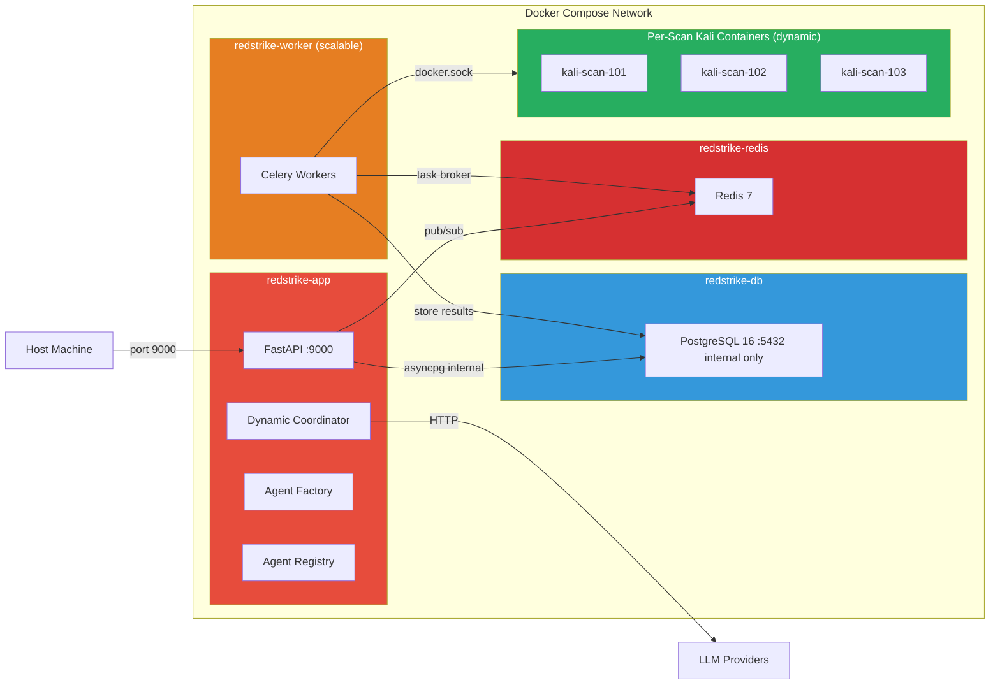
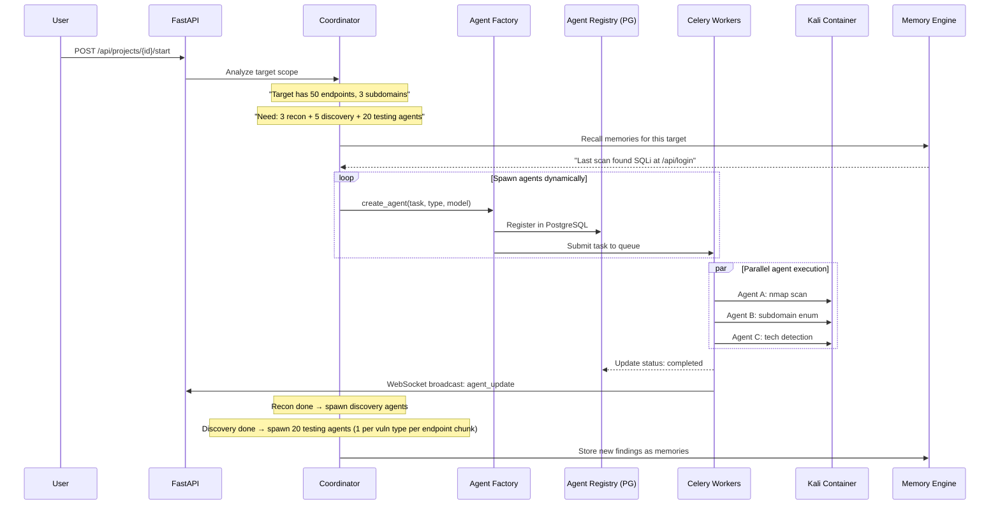
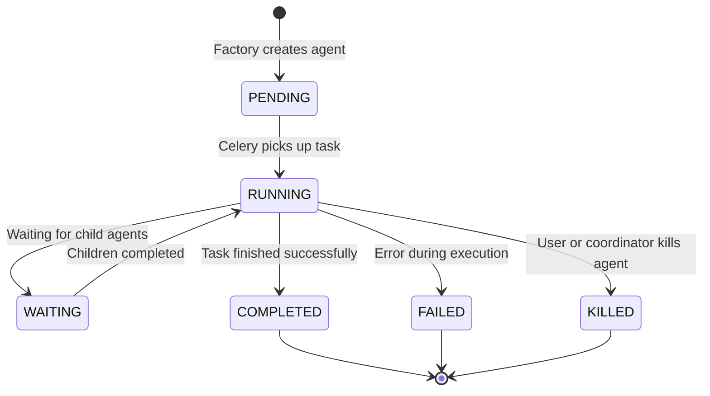
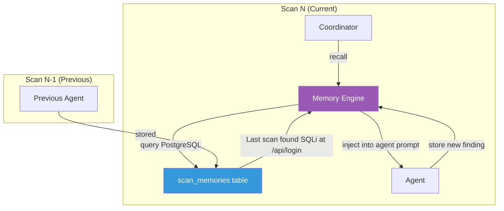
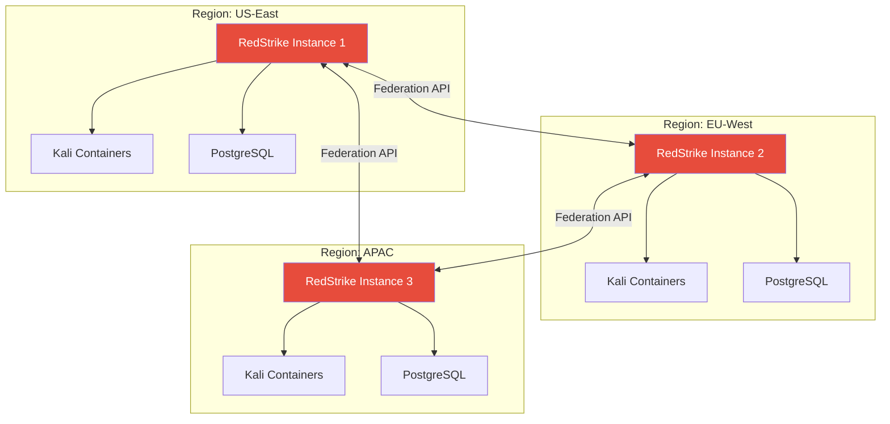

# RedStrike.AI 🎯

> Enterprise-grade autonomous AI penetration testing platform with **Dynamic Deep Agent Orchestration**

[](https://python.org)
[](https://fastapi.tiangolo.com)
[](https://github.com/langchain-ai/langgraph)
[](https://vitejs.dev)
[](https://docs.celeryq.dev)
[](https://docker.com)
[](LICENSE)


## 🚀 Overview

RedStrike.AI is an **enterprise-grade autonomous penetration testing platform** built on **Dynamic Deep Agent Orchestration**. Unlike static multi-agent systems that hardcode a fixed number of agents, RedStrike dynamically spawns, coordinates, and scales **100+ specialized agents** per scan — adapting agent count, type, and parallelism based on the target's attack surface.

The platform uses a **Coordinator → Agent Factory → Worker** pattern inspired by production multi-agent systems. A Dynamic Coordinator analyzes the target scope, spawns specialized worker agents on demand, and coordinates them through an inter-agent message bus — all executing security tools inside isolated, per-scan Kali Linux containers.

### ✨ Key Features

| Feature | Description |
|---------|-------------|
| 🧠 **Dynamic Agent Orchestration** | Coordinator spawns 100+ specialized agents on demand — agent count adapts to target complexity. No fixed agent limit. |
| 🏭 **Agent Factory** | Single factory creates any agent type at runtime with the right LLM model, tools, skills, and system prompt |
| 📡 **Inter-Agent Message Bus** | PostgreSQL + Redis pub/sub messaging — agents share findings, coordinate attacks, avoid duplicate work |
| 🧬 **Persistent Scan Memory** | PostgreSQL-backed memory engine — findings persist across scans. "Last time we scanned this target, we found SQLi at /api/login" |
| 🐳 **Per-Scan Container Isolation** | Each scan scope gets its own Kali Linux container. Multi-user, multi-project safe. |
| ⚡ **Distributed Task Queue** | Celery + Redis for agent execution — scale horizontally by adding worker nodes |
| 🌐 **Federation-Ready** | Architecture designed for multi-location deployment — RedStrike instances can connect and delegate scans across regions |
| 🎯 **OWASP Top 10 Coverage** | Skill-based agents for injection, broken auth, misconfig, SSRF, and more |
| 📚 **46 Skill Files** | Progressive disclosure knowledge system (summary → instructions → references) per the Agent Skills specification |
| 🔧 **30+ Security Tools** | Nmap, Nuclei, SQLmap, Dalfox, ffuf, Katana — all running in isolated Kali Docker containers |
| 🔀 **Per-Agent LLM Routing** | Different models per agent — supports 8 providers: Ollama, OpenAI, Anthropic, Groq, Google, Azure, Together, vLLM |
| 💬 **Natural Language Input** | Describe your target in plain English — AI parses scope, auth, rate limits, and test types |
| ⚛️ **React + Vite Dashboard** | Enterprise-grade SPA with live agent graph visualization, findings charts, and real-time WebSocket updates |
| ✅ **Two-Step Verification** | All findings verified by a dedicated Verifier agent with PoC generation before reporting |
| ⏯️ **Scan Lifecycle Control** | Start, pause, resume, cancel scans with state persistence and async progress tracking |

---

## 📋 Table of Contents

- [Quick Start](#-quick-start)
- [Architecture](#-architecture)
- [Dynamic Agent Engine](#-dynamic-agent-engine)
- [Scan Lifecycle](#-scan-lifecycle)
- [Agent Types](#-agent-types)
- [Memory System](#-memory-system)
- [Skill System](#-skill-system--knowledge-base)
- [LLM Configuration](#-llm-configuration)
- [API Reference](#-api-reference)
- [Tools Included](#-tools-included)
- [Configuration](#-configuration)
- [Federation & Future Roadmap](#-federation--future-roadmap)
- [Contributing](#-contributing)
- [Security Notice](#-security-notice)

---

## 🏁 Quick Start

### Prerequisites

- **Docker & Docker Compose** (v2.0+)
- **Ollama** (for local models) OR API keys for OpenAI/Anthropic/Groq/Google
- 16GB+ RAM recommended (for 50+ concurrent agents)

### Installation

```bash
# Clone the repository
git clone https://github.com/omkar-ukirde/RedStrike.AI.git
cd RedStrike.AI

# Copy environment file
cp .env.example .env

# Edit .env with your configuration
nano .env

# (Optional) Configure per-agent models
nano config/llm_config.yaml

# Build and start all services
docker-compose build
docker-compose up -d

# View logs to see your admin password
docker-compose logs -f app
```

### First Login

1. Open `http://localhost:9000` in your browser
2. Login with:
   - **Email:** `admin@redstrike.ai`
   - **Password:** Check the terminal logs for the auto-generated secure password

> ⚠️ On first run, a secure random password is generated if ADMIN_PASSWORD is set to `changeme123`

---

## 🧠 Architecture

RedStrike.AI is a **distributed, multi-container microservice** designed for enterprise-grade penetration testing at scale. The architecture is **federation-ready** — a single instance serves one organization, with future support for cross-region instance networking.

### System Overview

```
┌──────────────────────────────────────────────────────────────────────────────────┐
│                         REACT + VITE SPA (Port 9000)                            │
│                  Enterprise dashboard with Live Agent Graph                      │
└────────────────────────────────────────┬─────────────────────────────────────────┘
                                         │ REST + WebSocket
                                         ▼
┌──────────────────────────────────────────────────────────────────────────────────┐
│                          FASTAPI APPLICATION LAYER                               │
│  ┌─────────┐ ┌──────────┐ ┌──────────┐ ┌───────┐ ┌───────────┐ ┌───────────┐  │
│  │  Auth   │ │ Projects │ │ Findings │ │Agents │ │ WebSocket │ │Federation │  │
│  └─────────┘ └──────────┘ └──────────┘ └───────┘ └───────────┘ └───────────┘  │
└────────────────────────────────────────┬─────────────────────────────────────────┘
                                         │
                                         ▼
┌──────────────────────────────────────────────────────────────────────────────────┐
│              DYNAMIC DEEP AGENT ORCHESTRATION ENGINE                             │
│                                                                                  │
│  ┌──────────────────┐     ┌──────────────────┐     ┌──────────────────┐         │
│  │  COORDINATOR     │────▶│  AGENT FACTORY   │────▶│  AGENT REGISTRY  │         │
│  │  (Dynamic Plan)  │     │  (Spawn on       │     │  (PostgreSQL)    │         │
│  │                  │     │   Demand)         │     │  Track & Monitor │         │
│  └──────────────────┘     └──────────────────┘     └──────────────────┘         │
│          │                         │                         │                   │
│          ▼                         ▼                         ▼                   │
│  ┌──────────────────┐     ┌──────────────────┐     ┌──────────────────┐         │
│  │  MESSAGE BUS     │     │  MEMORY ENGINE   │     │  SKILL LOADER    │         │
│  │  (PG + Redis)    │     │  (PostgreSQL)    │     │  (Progressive    │         │
│  │  Inter-Agent     │     │  Cross-Scan      │     │   Disclosure)    │         │
│  │  Communication   │     │  Persistence     │     │                  │         │
│  └──────────────────┘     └──────────────────┘     └──────────────────┘         │
│          │                         │                                             │
│          ▼                         ▼                                             │
│  ┌──────────────────────────────────────────────────────────────────────┐        │
│  │                    CELERY DISTRIBUTED TASK QUEUE                      │        │
│  │                                                                      │        │
│  │  Worker 1: [Agent A] [Agent B] [Agent C] ...                        │        │
│  │  Worker 2: [Agent D] [Agent E] [Agent F] ...     (scale with       │        │
│  │  Worker N: [Agent G] [Agent H] ...                --scale=N)       │        │
│  └──────────────────────────────────────────────────────────────────────┘        │
└──────────────────────────────────────────────────────────────────────────────────┘
          │                    │                         │
          ▼                    ▼                         ▼
┌─────────────────┐  ┌──────────────────┐     ┌───────────────────┐
│   PostgreSQL    │  │     Redis        │     │  Per-Scan Kali    │
│  (Users,        │  │   (Celery Broker │     │  Containers       │
│   Projects,     │  │    + Pub/Sub     │     │                   │
│   Agents,       │  │    Message Bus)  │     │  Scan 1: kali-101 │
│   Memories,     │  │                  │     │  Scan 2: kali-102 │
│   Findings)     │  │                  │     │  Scan 3: kali-103 │
└─────────────────┘  └──────────────────┘     └───────────────────┘
```

### Deployment Topology



### Container Architecture

| Container | Purpose | Port | Scaling |
|-----------|---------|------|---------|
| `redstrike-app` | FastAPI + Coordinator + React SPA | 9000 | 1 instance |
| `redstrike-worker` | Celery workers executing agents | — | `--scale=N` |
| `redstrike-db` | PostgreSQL (internal only, no host exposure) | internal 5432 | 1 instance |
| `redstrike-redis` | Celery broker + Pub/Sub message bus | internal 6379 | 1 instance |
| `kali-scan-{id}` | Per-scan Kali Linux (created dynamically) | — | 1 per scan |

---

## ⚡ Dynamic Agent Engine

The core innovation of RedStrike.AI. Instead of 12 hardcoded agents, the system dynamically spawns any number of specialized agents based on target complexity.

### How It Works



### Static vs Dynamic Comparison

| Aspect | Old (Static) | New (Dynamic) |
|--------|-------------|---------------|
| **Agent count** | Fixed 12 | 1 to 100+ per scan |
| **Agent creation** | Compile-time, hardcoded nodes | Runtime, factory-spawned |
| **Parallelism** | Sequential (A → B → C) | Parallel within phases |
| **Scaling** | Single process | Celery workers (`--scale=N`) |
| **Target adaptation** | Same flow regardless of target | More endpoints = more agents |
| **Memory** | None | Cross-scan learning from PostgreSQL |
| **Container isolation** | 1 shared Kali | 1 Kali per scan scope |

### Agent Lifecycle



### Agent Graph (Parent-Child)

```
Coordinator (root)
├── network_recon_agent_1        ✅ completed
├── network_recon_agent_2        ✅ completed
├── web_recon_agent_1            ✅ completed
├── endpoint_discovery_agent_1   ✅ completed
├── endpoint_discovery_agent_2   ✅ completed
├── param_discovery_agent_1      ✅ completed
├── injection_tester_agent_1     🔄 running (testing /api/login)
├── injection_tester_agent_2     🔄 running (testing /api/users)
├── injection_tester_agent_3     ⏳ pending
├── ...                          (20+ more testing agents)
├── auth_tester_agent_1          🔄 running
├── config_tester_agent_1        ⏳ pending
├── verifier_agent_1             ⏳ pending (waits for findings)
└── reporter_agent_1             ⏳ pending (waits for verification)
```

This tree is visualized in real-time on the React dashboard via the **Live Agent Graph**.

---

## ⏯️ Scan Lifecycle

```
Create Project ──→ Parse Prompt ──→ Attack Plan ──→ Start Scan
      │                                                  │
      │            ┌──────────────────────────────────────┘
      │            ▼
      │     ┌─────────────┐
      │     │ Coordinator  │ ── Analyze scope, recall memories
      │     │ (Dynamic)    │ ── Spawn recon agents (parallel)
      │     └──────┬──────┘
      │            │ Recon results arrive
      │            ▼
      │     ┌─────────────┐
      │     │  Adapt Plan  │ ── Count endpoints → spawn N discovery agents
      │     │              │ ── Count params → spawn M testing agents
      │     └──────┬──────┘
      │            │ All testing agents complete
      │            ▼
      │     ┌─────────────┐    ┌──────────────┐
      │     │ Verification │ →  │   Reporter   │ →  Complete ✓
      │     │ (spawn per   │    │ (Markdown +   │
      │     │  finding)    │    │  CSV export)  │
      │     └─────────────┘    └──────────────┘
      │
      ├──→ Pause (state + agent graph saved to DB) ──→ Resume
      ├──→ Cancel (kills all active agents, releases Kali container)
      └──→ Delete Logs (keeps findings and memories)
```

---

## 🤖 Agent Types

The Agent Factory can create any of these agent types on demand. The Coordinator decides which and how many to spawn based on the target.

| Agent Type | Phase | Skill Categories | Tools | When Spawned |
|---|---|---|---|---|
| `network_recon` | Recon | `network/reconnaissance` | subfinder, nmap, httpx | Always (1-3 per scope) |
| `web_recon` | Recon | `network/recon`, `web/a05`, `configuration` | whatweb, wafw00f | Always (1 per domain) |
| `code_analyzer` | Recon | `web/a03-injection`, `web/a08` | — | Whitebox mode only |
| `endpoint_discovery` | Discovery | `reconnaissance` | ffuf, katana, gobuster | 1-5 per domain |
| `param_discovery` | Discovery | `reconnaissance` | arjun, paramspider | 1-3 per API surface |
| `injection_tester` | Testing | `web/a03`, `injection` | sqlmap, dalfox, curl | **1 per endpoint chunk × vuln type** |
| `auth_tester` | Testing | `web/a07`, `authentication` | curl | 1-3 per auth endpoint |
| `config_tester` | Testing | `web/a05`, `configuration` | curl | 1-2 per domain |
| `logic_tester` | Testing | `web/a04`, `logic` | curl | 1-2 per workflow |
| `vuln_scanner` | Testing | `web/a06`, `vulnerabilities` | nuclei, nikto | 1-3 per domain |
| `verifier` | Verify | `exploitation` | curl, sqlmap, dalfox | **1 per finding** |
| `reporter` | Report | — | — | 1 per scan |

### Dynamic Scaling Example

| Target | Endpoints | Agents Spawned |
|--------|-----------|----------------|
| Simple blog (5 pages) | 5 | ~12 agents |
| SaaS API (50 endpoints) | 50 | ~60 agents |
| Enterprise app (200 endpoints) | 200 | ~150+ agents |

---

## 🧬 Memory System

RedStrike.AI features an enterprise-grade **persistent scan memory** system backed by PostgreSQL. Memories enable cross-scan learning — the system remembers findings, techniques, and target characteristics from previous scans.

### How Memory Works



### Memory Types

| Type | Description | Example |
|------|-------------|---------|
| `finding` | Previously discovered vulnerability | "SQLi found at /api/login via `id` parameter" |
| `technique` | Effective attack technique for this target | "WAF bypass: use double URL encoding" |
| `target_info` | Target infrastructure details | "Runs nginx/1.18, PHP 8.1, MySQL 8.0" |
| `tool_output` | Key tool results | "Nuclei found 3 CVEs in jQuery 3.4.1" |

### Freshness System

Memories include age-based freshness warnings:

| Age | Freshness | Injected Note |
|-----|-----------|---------------|
| ≤ 1 day | Fresh | *(none)* |
| 2-7 days | Recent | ⚠️ *"This memory is N days old. Verify against current scan data."* |
| 8-30 days | Aging | ⚠️ *"This memory is N days old. Target may have changed."* |
| 30+ days | Stale | ⚠️ *"This memory is N days old. Treat as unverified."* |

---

## 📚 Skill System & Knowledge Base

RedStrike uses the **Agent Skills specification** (`agentskills.io` format) with **progressive disclosure** — loading knowledge at three levels:

| Level | Content | Size | When Loaded |
|-------|---------|------|-------------|
| **1. Summary** | Name + description + tags | ~100 tokens | Agent startup |
| **2. Instructions** | Full `SKILL.md` body | <5000 tokens | Agent activated |
| **3. References** | Detailed technique files in `references/` | On demand | Agent requests detail |

### Skill Structure

```
skills/                                   # 46 SKILL.md files + 113 reference files
├── active-directory/                     # AD attack skills
├── authentication/                       # IDOR, JWT attacks
├── configuration/                        # CORS, headers
├── exploitation/                         # PoC templates
├── injection/                            # XSS, SQLi, SSRF, SSTI, XXE, RCE, LFI
├── logic/                                # Race conditions, business logic
├── mobile/                               # Android, iOS pentesting
├── network/                              # Network service pentesting (8 subcategories)
├── reconnaissance/                       # Subdomain enum, port scanning
├── vulnerabilities/                      # XSS, SQLi, SSRF, IDOR testing guides
└── web/                                  # OWASP Top 10 mapped skills (11 subcategories)
```

Each agent type has mapped skill categories — the Agent Factory loads the right skills based on agent type.

---

## ⚙️ LLM Configuration

RedStrike uses a **per-agent LLM routing** system. Each dynamically spawned agent can use a different provider and model, configured via `config/llm_config.yaml`.

### Supported Providers (8)

| Provider | Example Models | Config Key | Auth |
|----------|---------------|------------|------|
| Ollama | `qwen2.5:7b`, `mistral:7b`, `llama3.1` | `ollama` | None (local) |
| OpenAI | `gpt-4o`, `gpt-4-turbo` | `openai` | `OPENAI_API_KEY` |
| Anthropic | `claude-3-opus`, `claude-3-sonnet` | `anthropic` | `ANTHROPIC_API_KEY` |
| Groq | `llama-3.1-70b-versatile`, `mixtral-8x7b` | `groq` | `GROQ_API_KEY` |
| Google | `gemini-1.5-pro`, `gemini-1.5-flash` | `google` | `GOOGLE_API_KEY` |
| Azure | `gpt-4`, `gpt-35-turbo` | `azure` | `AZURE_OPENAI_API_KEY` |
| Together | `meta-llama/Llama-3-70b-chat-hf` | `together` | `TOGETHER_API_KEY` |
| vLLM | Any self-hosted model | `vllm` | None (local) |

### Per-Agent Configuration Example

```yaml
# config/llm_config.yaml
default:
  provider: "ollama"
  model: "qwen2.5:7b"
  api_base: "http://localhost:11434"
  temperature: 0.1
  max_tokens: 4096

agents:
  # Strong reasoning for orchestration/coordination
  coordinator:
    provider: "ollama"
    model: "qwen2.5:14b"

  # Security-focused code model for injection testing
  injection_tester:
    provider: "ollama"
    model: "qwen2.5-coder:14b"

  # Strong code generation for PoC verification
  verifier:
    provider: "ollama"
    model: "qwen2.5-coder:20b"
    max_tokens: 8192

  # Fast model for recon tasks (many agents, keep it light)
  network_recon:
    provider: "ollama"
    model: "mistral:7b"
```

---

## 📡 API Reference

### Authentication

```bash
# Login
curl -X POST http://localhost:9000/api/auth/login \
  -H "Content-Type: application/json" \
  -d '{"email": "admin@redstrike.ai", "password": "your-password"}'

# Response: {"access_token": "eyJ...", "token_type": "bearer"}
```

### API Endpoints

| Endpoint | Method | Description |
|----------|--------|-------------|
| `/api/auth/login` | POST | Authenticate user |
| `/api/auth/register` | POST | Register new user (admin only) |
| `/api/auth/me` | GET | Get current user info |
| **Projects** | | |
| `/api/projects/` | GET | List all projects |
| `/api/projects/` | POST | Create new project (parses prompt with AI) |
| `/api/projects/{id}` | GET | Get project details |
| `/api/projects/{id}` | PATCH | Update project |
| `/api/projects/{id}` | DELETE | Delete project |
| `/api/projects/{id}/start` | POST | Start or resume scan |
| `/api/projects/{id}/pause` | POST | Pause running scan |
| `/api/projects/{id}/cancel` | POST | Cancel scan (kills all agents) |
| `/api/projects/{id}/status` | GET | Get scan progress |
| **Findings** | | |
| `/api/projects/{id}/findings` | GET | List findings |
| `/api/projects/{id}/findings/{fid}` | GET | Get finding details |
| `/api/projects/{id}/findings/{fid}` | PATCH | Update finding |
| `/api/projects/{id}/export` | GET | Export findings as CSV |
| **Agents** | | |
| `/api/projects/{id}/agents` | GET | **Live agent graph** (parent-child tree with statuses) |
| `/api/projects/{id}/agents/{aid}` | GET | Agent detail (messages, result, timing) |
| `/api/projects/{id}/agents/{aid}/kill` | POST | Kill a specific running agent |
| **Memory** | | |
| `/api/projects/{id}/memories` | GET | Get persisted memories for this target |
| **Discovery** | | |
| `/api/projects/{id}/endpoints` | GET | List discovered endpoints |
| `/api/projects/{id}/sitemap` | GET | Get sitemap tree |
| `/api/projects/{id}/history` | GET | Get HTTP history |
| `/api/projects/{id}/logs` | DELETE | Delete scan logs |
| **System** | | |
| `/api/health` | GET | Health check |
| `/api/config` | GET | Public configuration |
| **Federation** *(future)* | | |
| `/api/federation/nodes` | GET | List registered federation nodes |
| `/api/federation/register` | POST | Register a remote RedStrike instance |
| `/api/federation/delegate` | POST | Delegate a scan to a remote node |
| **WebSocket** | | |
| `/ws/projects/{id}` | WebSocket | Real-time updates (auth via `?token=`) |

### WebSocket Events

| Event Type | Direction | Description |
|------------|-----------|-------------|
| `scan_update` | Server → Client | Phase progress |
| `agent_update` | Server → Client | Agent status change (spawned, completed, failed) |
| `agent_graph` | Server → Client | Full agent tree snapshot (for live graph) |
| `new_finding` | Server → Client | New vulnerability discovered |
| `new_endpoint` | Server → Client | New endpoint discovered |
| `scan_complete` | Server → Client | Scan finished with summary |
| `ping` / `pong` | Bidirectional | Keep-alive |

---

## 🔧 Tools Included

### Security Tools (Kali Linux Container)

| Category | Tools |
|----------|-------|
| **Reconnaissance** | subfinder, httpx, nmap, whatweb, wafw00f, amass, dnsrecon |
| **Content Discovery** | ffuf, gobuster, feroxbuster, katana, waybackurls |
| **Vulnerability Scanning** | nuclei (with templates), nikto |
| **Injection Testing** | sqlmap, dalfox |
| **Parameter Discovery** | arjun, paramspider |
| **Wordlists** | SecLists (common, directories, passwords, fuzzing) |
| **Utilities** | curl, wget, git, jq, python3 |

### Tool Execution Pipeline

```
Coordinator spawns agent → Agent decides tool → LangChain StructuredTool
                                                        │
                                            Celery Task → DockerExecutor
                                                        │
                                     Docker SDK exec_run() on per-scan Kali
                                                        │
                                              stdout/stderr → JSON result
                                                        │
                                     Result → Agent → Registry → WebSocket
```

---

## 🔐 Environment Configuration

```bash
# Database
DATABASE_URL=postgresql+asyncpg://redstrike:redstrike@db:5432/redstrike

# Redis (Celery broker + message bus)
CELERY_BROKER_URL=redis://redis:6379/0

# JWT Settings
JWT_SECRET_KEY=your-super-secret-key-change-in-production
JWT_ACCESS_TOKEN_EXPIRE_MINUTES=30

# LLM (fallback — per-agent config is in config/llm_config.yaml)
LITELLM_MODEL=ollama/llama3.2
OLLAMA_API_BASE=http://localhost:11434

# Optional: Cloud provider API keys
# OPENAI_API_KEY=sk-...
# ANTHROPIC_API_KEY=sk-ant-...
# GROQ_API_KEY=gsk-...

# Docker Settings
DOCKER_NETWORK=redstrike-network

# Admin User (created on first run)
ADMIN_EMAIL=admin@redstrike.ai
ADMIN_PASSWORD=changeme123  # Auto-generates secure password if unchanged
```

---

## 🌐 Federation & Future Roadmap

RedStrike.AI is designed to be **federation-ready** — enabling organizations to deploy multiple instances across regions that communicate intelligently.

### Federation Architecture (Future)



### Roadmap

| Priority | Feature | Status |
|----------|---------|--------|
| 🔴 | Dynamic Agent Engine (Factory, Registry, Coordinator) | 🔄 In Progress |
| 🔴 | PostgreSQL Memory Engine | 🔄 In Progress |
| 🔴 | Celery + Redis distributed backend | ⏳ Planned |
| 🔴 | React + Vite frontend migration | ⏳ Planned |
| 🔴 | Live Agent Graph visualization | ⏳ Planned |
| 🟡 | Alembic database migrations | ⏳ Planned |
| 🟡 | Federation API stubs | ⏳ Planned |
| 🟡 | Multi-location scan delegation | ⏳ Future |
| 🟢 | Scheduled scans | ⏳ Future |
| 🟢 | PDF report export | ⏳ Future |
| 🟢 | Slack/email notifications | ⏳ Future |

### ✅ Completed

| Feature | Description |
|---------|-------------|
| LangGraph Deep Agents | Migrated from smolagents to LangGraph |
| Per-Agent LLM Config | 8-provider routing via `llm_config.yaml` |
| Skill System v2 | Progressive disclosure, 46 skills, 113 refs |
| Scan Control | Pause, resume, cancel, delete logs |
| Async Status Polling | `GET /api/projects/{id}/status` |
| Security Hardening | DB not exposed to host, per-scan isolation |

---

## 🤝 Contributing

Contributions are welcome!

1. Fork the repository
2. Create a feature branch: `git checkout -b feature/amazing-feature`
3. Commit your changes: `git commit -m 'Add amazing feature'`
4. Push to the branch: `git push origin feature/amazing-feature`
5. Open a Pull Request

### Project Structure

```
RedStrike.AI/
├── app/
│   ├── agents/                  # Dynamic Agent Engine
│   │   ├── graph.py             # 3-node StateGraph (coordinator → executor → reporter)
│   │   ├── orchestrator.py      # Dynamic Coordinator (plans + spawns agents)
│   │   ├── factory.py           # Agent Factory (creates any agent type on demand)
│   │   ├── registry.py          # Agent Registry (PostgreSQL-backed tracking)
│   │   ├── message_bus.py       # Inter-Agent Message Bus (PG + Redis)
│   │   ├── container_pool.py    # Per-Scan Kali Container Manager
│   │   ├── state.py             # ScanState TypedDict schema
│   │   ├── skill_subagent.py    # Skill-aware subagent factory
│   │   └── memory/              # Memory Engine
│   │       ├── engine.py        # CRUD + recall
│   │       ├── relevance.py     # LLM-based memory selection
│   │       ├── freshness.py     # Staleness warnings
│   │       └── consolidation.py # Post-scan memory extraction
│   ├── api/                     # FastAPI route handlers
│   │   ├── auth.py, projects.py, findings.py, endpoints.py
│   │   ├── agents.py            # Agent management endpoints
│   │   ├── federation.py        # Federation stubs (future)
│   │   └── websocket.py         # Real-time updates
│   ├── workers/                 # Celery distributed workers
│   │   ├── celery_app.py        # Celery configuration
│   │   ├── agent_tasks.py       # Agent execution tasks
│   │   └── scan_tasks.py        # Scan lifecycle tasks
│   ├── core/                    # Config, database, security
│   ├── models/                  # SQLAlchemy models + LLM router
│   ├── services/                # ScanService, SkillLoader
│   ├── tools/                   # LangChain tool wrappers + DockerExecutor
│   └── main.py                  # FastAPI app entry point
├── frontend/                    # React + Vite SPA (TypeScript)
├── config/
│   └── llm_config.yaml          # Per-agent LLM configuration
├── docker/
│   ├── Dockerfile.app           # Python FastAPI container
│   └── Dockerfile.kali          # Kali Linux + 30+ tools
├── skills/                      # 11 categories, 46 skills, 113 references
├── docker-compose.yml
├── requirements.txt
└── .env.example
```

---

## ⚠️ Security Notice

> **WARNING**: This tool is designed for **authorized security testing only**.

- ✅ Only test systems you have **explicit permission** to test
- ✅ Respect **scope boundaries** defined in your engagement
- ✅ Follow **responsible disclosure** practices
- ✅ Comply with all applicable **laws and regulations**

**The developers are not responsible for misuse of this tool.**

---

## 📄 License

MIT License - See [LICENSE](LICENSE) for details.

---

## 🙏 Acknowledgments

- [LangGraph](https://github.com/langchain-ai/langgraph) - Deep Agents multi-agent orchestration
- [LangChain](https://github.com/langchain-ai/langchain) - LLM application framework
- [FastAPI](https://fastapi.tiangolo.com/) - Modern async web framework
- [Celery](https://docs.celeryq.dev/) - Distributed task queue
- [Kali Linux](https://www.kali.org/) - Security tools platform
- [SecLists](https://github.com/danielmiessler/SecLists) - Security wordlists
- [Agent Skills](https://agentskills.io/) - Skill file specification

---

<p align="center">
  <strong>RedStrike.AI</strong> — Enterprise Autonomous Penetration Testing with Dynamic Deep Agents 🧠
</p>
