# RedStrike.AI — System Architecture

> Detailed architecture document for RedStrike.AI, an enterprise-grade autonomous penetration testing platform built on **Dynamic Deep Agent Orchestration** with distributed task execution.

**Version:** 2.0.0  
**Last Updated:** April 2026  
**Author:** Omkar Ukirde

---

## Table of Contents

1. [System Overview](#1-system-overview)
2. [Technology Stack](#2-technology-stack)
3. [Deployment Topology](#3-deployment-topology)
4. [Dynamic Agent Engine](#4-dynamic-agent-engine)
5. [Agent Registry & Lifecycle](#5-agent-registry--lifecycle)
6. [Agent Factory & Types](#6-agent-factory--types)
7. [Memory Engine](#7-memory-engine)
8. [Skill System (Progressive Disclosure)](#8-skill-system-progressive-disclosure)
9. [LLM Router (Multi-Provider)](#9-llm-router-multi-provider)
10. [Tool Execution Pipeline](#10-tool-execution-pipeline)
11. [Database Schema](#11-database-schema)
12. [API Layer](#12-api-layer)
13. [Real-time Communication](#13-real-time-communication)
14. [Scan Lifecycle & Data Flow](#14-scan-lifecycle--data-flow)
15. [Security Design](#15-security-design)
16. [Distributed Architecture (Celery + Redis)](#16-distributed-architecture)
17. [Frontend Architecture (React + Vite)](#17-frontend-architecture)
18. [Federation Roadmap](#18-federation-roadmap)
19. [Key Design Decisions](#19-key-design-decisions)

---

## 1. System Overview

RedStrike.AI is a **distributed, multi-container microservice** application that automates enterprise-grade web penetration testing using **dynamically spawned AI agents**. A user provides a natural language prompt, and the system:

1. **Parses** the prompt to extract target URL, scope, authentication, and rate limits
2. **Recalls** memories from previous scans of the same target
3. **Plans** an attack strategy and **dynamically spawns 10-100+ agents** based on target complexity
4. **Executes** 30+ security tools across **parallel agents** in isolated, per-scan Kali Linux containers
5. **Coordinates** inter-agent communication via a PostgreSQL + Redis message bus
6. **Verifies** findings with dynamically spawned Verifier agents with PoC generation
7. **Stores** scan memories in PostgreSQL for cross-scan learning
8. **Reports** results with reproduction steps and Python exploit code

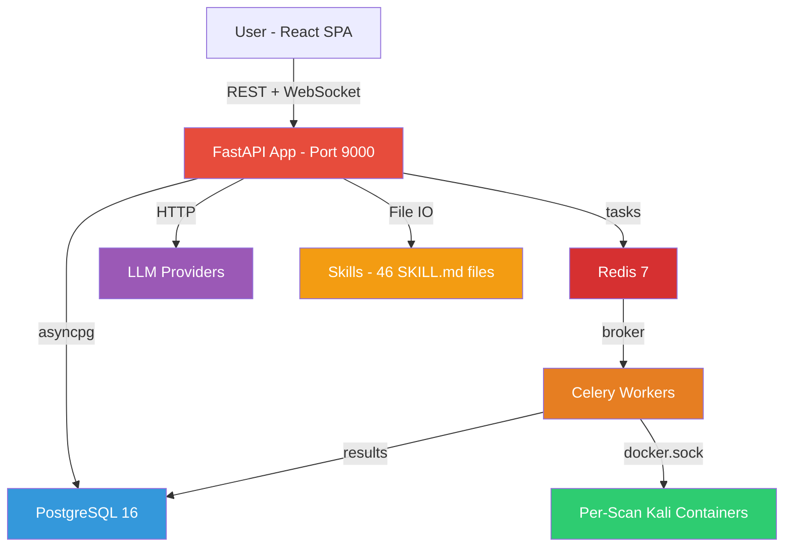
```mermaid
graph TB
    User["User - React SPA"] -->|REST + WebSocket| App["FastAPI App - Port 9000"]
    App -->|asyncpg| DB["PostgreSQL 16"]
    App -->|tasks| Redis["Redis 7"]
    Redis -->|broker| Celery["Celery Workers"]
    Celery -->|docker.sock| Kali["Per-Scan Kali Containers"]
    App -->|HTTP| LLM["LLM Providers"]
    App -->|File IO| Skills["Skills - 46 SKILL.md files"]
    Celery -->|results| DB

    style App fill:#e74c3c,color:#fff
    style DB fill:#3498db,color:#fff
    style Redis fill:#d63031,color:#fff
    style Celery fill:#e67e22,color:#fff
    style Kali fill:#2ecc71,color:#fff
    style LLM fill:#9b59b6,color:#fff
    style Skills fill:#f39c12,color:#fff
```

---

## 2. Technology Stack

| Layer | Technology | Purpose |
|-------|-----------|---------|
| **Web Framework** | FastAPI 0.115+ | Async REST API + WebSocket |
| **Agent Framework** | LangGraph 0.2+ | Deep Agents — `StateGraph`, `create_react_agent`, conditional routing |
| **LLM Integration** | LangChain Core 0.3+ | Tool bindings, message types, chat model abstractions |
| **LLM Providers** | LangChain-Ollama/OpenAI/Anthropic/Groq/Google | 8 provider-specific ChatModel implementations |
| **Task Queue** | Celery 5.4+ | Distributed agent execution across worker nodes |
| **Message Broker** | Redis 7 | Celery broker + inter-agent pub/sub message bus |
| **Database** | PostgreSQL 16 + SQLAlchemy 2.0 (async) | Agents, memories, findings — enterprise-grade persistence |
| **Auth** | python-jose + passlib (bcrypt) | JWT-based authentication |
| **Tool Execution** | Docker SDK (Python) | Execute commands in per-scan Kali containers via `docker.sock` |
| **Frontend** | React 18 + Vite + TypeScript | Enterprise SPA with live agent graph visualization |
| **Agent Graph UI** | React Flow (@xyflow/react) | Real-time agent tree visualization |
| **Containerization** | Docker Compose | Multi-container orchestration with dynamic Kali spawning |

### Python Dependencies (Key)

```
langgraph>=0.2.0          # Deep Agent orchestration
langchain-core>=0.3.0     # LLM abstractions
langchain-ollama>=0.2.0   # Ollama provider
langchain-openai>=0.2.0   # OpenAI/Azure/vLLM/Together
langchain-anthropic>=0.2.0
langchain-groq>=0.2.0
langchain-google-genai>=2.0.0
fastapi>=0.115.2
sqlalchemy[asyncio]>=2.0.25
docker>=7.0.0
litellm>=1.55.0
```

---

## 3. Deployment Topology

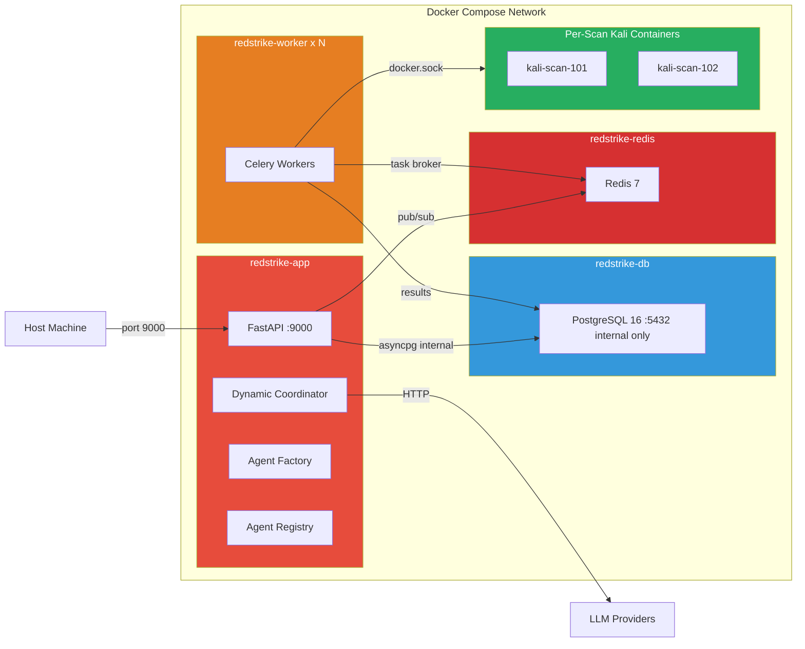
```mermaid
graph LR
    subgraph Docker["Docker Compose Network"]
        subgraph AppContainer["redstrike-app"]
            FastAPI["FastAPI :9000"]
            Coordinator["Dynamic Coordinator"]
            Factory["Agent Factory"]
            Registry["Agent Registry"]
        end

        subgraph WorkerContainer["redstrike-worker x N"]
            Celery["Celery Workers"]
        end

        subgraph DBContainer["redstrike-db"]
            Postgres["PostgreSQL 16 :5432 internal only"]
        end

        subgraph RedisContainer["redstrike-redis"]
            Redis["Redis 7"]
        end

        subgraph KaliContainers["Per-Scan Kali Containers"]
            K1["kali-scan-101"]
            K2["kali-scan-102"]
        end
    end

    Host["Host Machine"] -->|port 9000| FastAPI
    FastAPI -->|asyncpg internal| Postgres
    FastAPI -->|pub/sub| Redis
    Celery -->|task broker| Redis
    Celery -->|results| Postgres
    Celery -->|docker.sock| KaliContainers
    Coordinator -->|HTTP| LLM["LLM Providers"]

    style AppContainer fill:#e74c3c,color:#fff
    style WorkerContainer fill:#e67e22,color:#fff
    style DBContainer fill:#3498db,color:#fff
    style RedisContainer fill:#d63031,color:#fff
    style KaliContainers fill:#27ae60,color:#fff
```

### Container Architecture

| Container | Purpose | Port | Scaling |
|-----------|---------|------|----------|
| `redstrike-app` | FastAPI + Coordinator + React SPA | 9000 | 1 instance |
| `redstrike-worker` | Celery workers executing agents | internal | `--scale=N` |
| `redstrike-db` | PostgreSQL (internal only) | internal 5432 | 1 instance |
| `redstrike-redis` | Celery broker + Message Bus | internal 6379 | 1 instance |
| `kali-scan-{id}` | Per-scan Kali Linux (dynamic) | — | 1 per active scan |

### Volume Mounts

| Container | Mount | Purpose |
|-----------|-------|---------|
| `redstrike-app` | `.:/app` | Application code (hot-reload) |
| `redstrike-app` | `./skills:/app/skills` | Skill files |
| `redstrike-app` | `/var/run/docker.sock` | Docker SDK access |
| `redstrike-worker` | `.:/app` | Application code |
| `redstrike-worker` | `/var/run/docker.sock` | Docker SDK for Kali containers |
| `redstrike-db` | `postgres_data:/var/lib/postgresql/data` | Persistent database storage |
| `redstrike-redis` | `redis_data:/data` | Redis persistence |

---

## 4. Dynamic Agent Engine

RedStrike uses a **Dynamic Deep Agent Orchestration** pattern — replacing a static fixed-agent graph with a runtime agent factory:

- A **Dynamic Coordinator** analyzes the target and plans agent spawning
- An **Agent Factory** creates any agent type on demand with the right model, tools, and skills
- An **Agent Registry** (PostgreSQL-backed) tracks all agents, their status, and parent-child relationships
- A **Message Bus** (PostgreSQL + Redis) enables inter-agent communication
- A **Memory Engine** (PostgreSQL) persists findings across scans for cross-scan learning
- **Celery Workers** execute agents in parallel across distributed worker nodes

### Simplified StateGraph (3 Nodes)

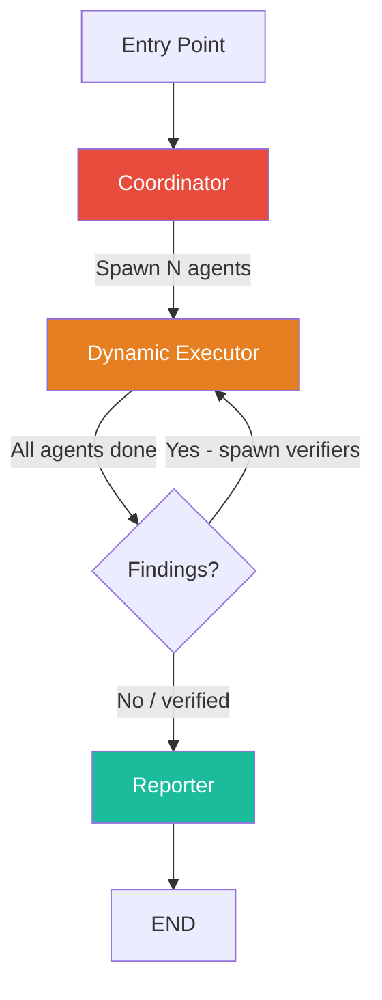
```mermaid
graph TD
    Entry["Entry Point"] --> Coord["Coordinator"]
    Coord -->|"Spawn N agents"| Exec["Dynamic Executor"]
    Exec -->|"All agents done"| Check{"Findings?"}
    Check -->|"Yes - spawn verifiers"| Exec
    Check -->|"No / verified"| Report["Reporter"]
    Report --> End["END"]

    style Coord fill:#e74c3c,color:#fff
    style Exec fill:#e67e22,color:#fff
    style Report fill:#1abc9c,color:#fff
```

The Coordinator dynamically spawns agents inside the Executor node:


```mermaid
graph TD
    Coord["Coordinator"] -->|spawn| R1["Recon Agent 1"]
    Coord -->|spawn| R2["Recon Agent 2"]
    Coord -->|spawn| R3["Web Recon Agent"]
    
    R1 -->|results| Coord
    R2 -->|results| Coord
    R3 -->|results| Coord
    
    Coord -->|"50 endpoints found"| D1["Discovery 1"]
    Coord --> D2["Discovery 2"]
    Coord --> D3["Discovery 3"]
    
    D1 --> Coord
    D2 --> Coord
    D3 --> Coord
    
    Coord -->|"1 per vuln type x endpoint chunk"| T1["Injection Agent 1"]
    Coord --> T2["Injection Agent 2"]
    Coord --> T3["Auth Agent 1"]
    Coord --> T4["Config Agent 1"]
    Coord --> TN["... N more agents"]

    style Coord fill:#e74c3c,color:#fff
    style R1 fill:#3498db,color:#fff
    style R2 fill:#3498db,color:#fff
    style R3 fill:#3498db,color:#fff
    style D1 fill:#2ecc71,color:#fff
    style D2 fill:#2ecc71,color:#fff
    style D3 fill:#2ecc71,color:#fff
    style T1 fill:#e67e22,color:#fff
    style T2 fill:#e67e22,color:#fff
    style T3 fill:#e67e22,color:#fff
    style T4 fill:#e67e22,color:#fff
    style TN fill:#e67e22,color:#fff
```

### Why Dynamic Agents?

| Static Approach (Old) | Dynamic Approach (New) |
|---------------------|----------------------------------|
| Fixed 12 agents for every scan | 10-100+ agents adapted to target complexity |
| Sequential execution (A → B → C) | Parallel execution within phases |
| Single shared Kali container | Per-scan isolated Kali container |
| No inter-agent communication | Message bus for findings sharing |
| No memory across scans | PostgreSQL-backed persistent memory |
| Single process | Distributed Celery workers (scale horizontally) |
| Per-agent LLM routing | Per-agent LLM routing (preserved) |
| Progressive disclosure skills | Progressive disclosure skills (preserved) |

---

## 5. Agent Registry & Lifecycle

### Agent Instance Schema

Every dynamically spawned agent is tracked in PostgreSQL via the `agent_instances` table:

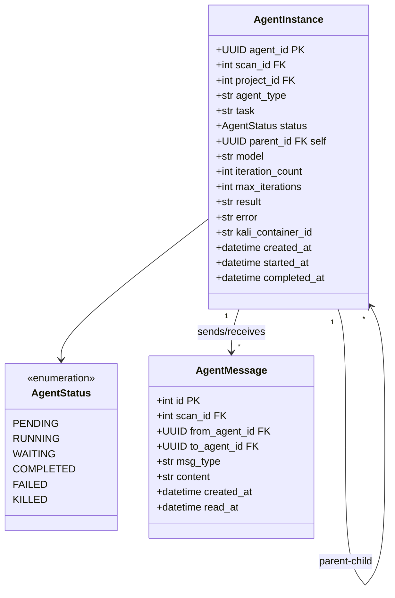
```mermaid
classDiagram
    class AgentInstance {
        +UUID agent_id PK
        +int scan_id FK
        +int project_id FK
        +str agent_type
        +str task
        +AgentStatus status
        +UUID parent_id FK self
        +str model
        +int iteration_count
        +int max_iterations
        +str result
        +str error
        +str kali_container_id
        +datetime created_at
        +datetime started_at
        +datetime completed_at
    }

    class AgentStatus {
        <<enumeration>>
        PENDING
        RUNNING
        WAITING
        COMPLETED
        FAILED
        KILLED
    }

    class AgentMessage {
        +int id PK
        +int scan_id FK
        +UUID from_agent_id FK
        +UUID to_agent_id FK
        +str msg_type
        +str content
        +datetime created_at
        +datetime read_at
    }

    AgentInstance --> AgentStatus
    AgentInstance "1" --> "*" AgentInstance : parent-child
    AgentInstance "1" --> "*" AgentMessage : sends/receives
```

### Agent Lifecycle State Machine

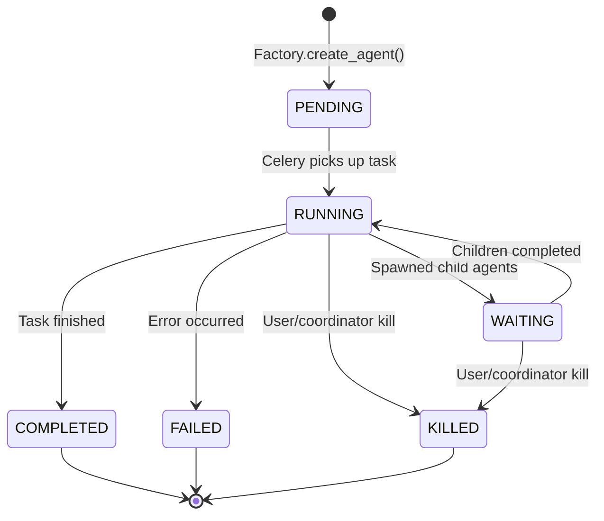
```mermaid
stateDiagram-v2
    [*] --> PENDING: Factory.create_agent()
    PENDING --> RUNNING: Celery picks up task
    RUNNING --> WAITING: Spawned child agents
    WAITING --> RUNNING: Children completed
    RUNNING --> COMPLETED: Task finished
    RUNNING --> FAILED: Error occurred
    RUNNING --> KILLED: User/coordinator kill
    WAITING --> KILLED: User/coordinator kill
    COMPLETED --> [*]
    FAILED --> [*]
    KILLED --> [*]
```

### Global Agent Registry API

```python
class GlobalAgentRegistry:
    """PostgreSQL-backed agent registry for enterprise auditability."""
    
    async def register(scan_id, agent_type, task, parent_id, model, 
                       kali_container_id) -> AgentRecord
    async def update_status(agent_id, status, result=None, error=None)
    async def get_children(agent_id) -> List[AgentRecord]
    async def get_agent(agent_id) -> Optional[AgentRecord]
    async def get_scan_agents(scan_id) -> List[AgentRecord]
    async def get_active_count(scan_id) -> int
    async def get_graph_snapshot(scan_id) -> Dict  # For React Flow UI
    async def kill_agent(agent_id)
    async def kill_all(scan_id)
```

### ScanState Schema (Updated)

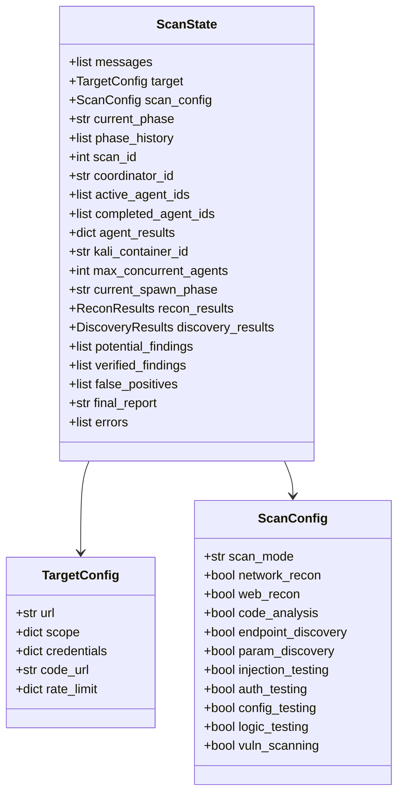
```mermaid
classDiagram
    class ScanState {
        +list messages
        +TargetConfig target
        +ScanConfig scan_config
        +str current_phase
        +list phase_history
        +int scan_id
        +str coordinator_id
        +list active_agent_ids
        +list completed_agent_ids
        +dict agent_results
        +str kali_container_id
        +int max_concurrent_agents
        +str current_spawn_phase
        +ReconResults recon_results
        +DiscoveryResults discovery_results
        +list potential_findings
        +list verified_findings
        +list false_positives
        +str final_report
        +list errors
    }

    class TargetConfig {
        +str url
        +dict scope
        +dict credentials
        +str code_url
        +dict rate_limit
    }

    class ScanConfig {
        +str scan_mode
        +bool network_recon
        +bool web_recon
        +bool code_analysis
        +bool endpoint_discovery
        +bool param_discovery
        +bool injection_testing
        +bool auth_testing
        +bool config_testing
        +bool logic_testing
        +bool vuln_scanning
    }

    ScanState --> TargetConfig
    ScanState --> ScanConfig
```

---

## 6. Agent Factory & Types

### How the Factory Works

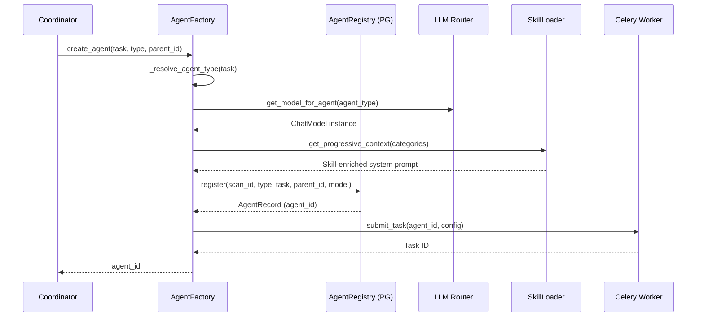
```mermaid
sequenceDiagram
    participant Coord as Coordinator
    participant Factory as AgentFactory
    participant Registry as AgentRegistry (PG)
    participant Router as LLM Router
    participant Skills as SkillLoader
    participant Celery as Celery Worker

    Coord->>Factory: create_agent(task, type, parent_id)
    Factory->>Factory: _resolve_agent_type(task)
    Factory->>Router: get_model_for_agent(agent_type)
    Router-->>Factory: ChatModel instance
    Factory->>Skills: get_progressive_context(categories)
    Skills-->>Factory: Skill-enriched system prompt
    Factory->>Registry: register(scan_id, type, task, parent_id, model)
    Registry-->>Factory: AgentRecord (agent_id)
    Factory->>Celery: submit_task(agent_id, config)
    Celery-->>Factory: Task ID
    Factory-->>Coord: agent_id
```

### Agent Type Mappings

| Agent Type | Skill Categories | Tools | Spawning Rule |
|---|---|---|---|
| `network_recon` | `network/reconnaissance` | subfinder, nmap, httpx | 1-3 per scope |
| `web_recon` | `network/recon`, `web/a05`, `configuration` | whatweb, wafw00f | 1 per domain |
| `code_analyzer` | `web/a03-injection`, `web/a08` | — | Whitebox only |
| `endpoint_discovery` | `reconnaissance` | ffuf, katana, gobuster | 1-5 per domain |
| `param_discovery` | `reconnaissance` | arjun, paramspider | 1-3 per API |
| `injection_tester` | `web/a03`, `injection` | sqlmap, dalfox, curl | 1 per endpoint chunk × vuln type |
| `auth_tester` | `web/a07`, `authentication` | curl | 1-3 per auth endpoint |
| `config_tester` | `web/a05`, `configuration` | curl | 1-2 per domain |
| `logic_tester` | `web/a04`, `logic` | curl | 1-2 per workflow |
| `vuln_scanner` | `web/a06`, `vulnerabilities` | nuclei, nikto | 1-3 per domain |
| `verifier` | `exploitation` | curl, sqlmap, dalfox | 1 per finding |
| `reporter` | — | — | 1 per scan |

### Context Window Management

Each agent uses a `pre_model_hook` to prevent context overflow:

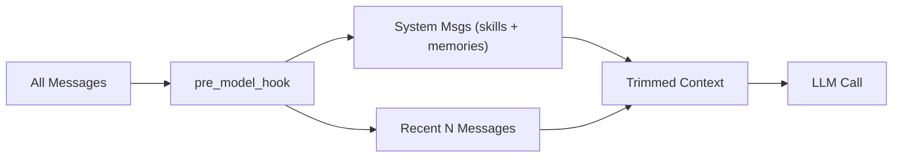
```mermaid
graph LR
    A["All Messages"] --> B["pre_model_hook"]
    B --> C["System Msgs (skills + memories)"]
    B --> D["Recent N Messages"]
    C --> E["Trimmed Context"]
    D --> E
    E --> F["LLM Call"]
```

### Per-Scan Container Isolation

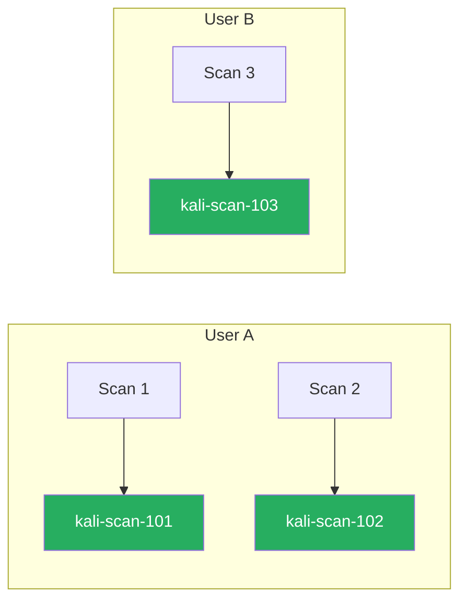
```mermaid
graph LR
    subgraph "User A"
        S1["Scan 1"] --> K1["kali-scan-101"]
        S2["Scan 2"] --> K2["kali-scan-102"]
    end
    subgraph "User B"
        S3["Scan 3"] --> K3["kali-scan-103"]
    end

    style K1 fill:#27ae60,color:#fff
    style K2 fill:#27ae60,color:#fff
    style K3 fill:#27ae60,color:#fff
```

Each scan scope gets its own Kali container. Multi-user safe — User A's agents can't access User B's container.

---

## 7. Memory Engine

### Cross-Scan Memory Architecture

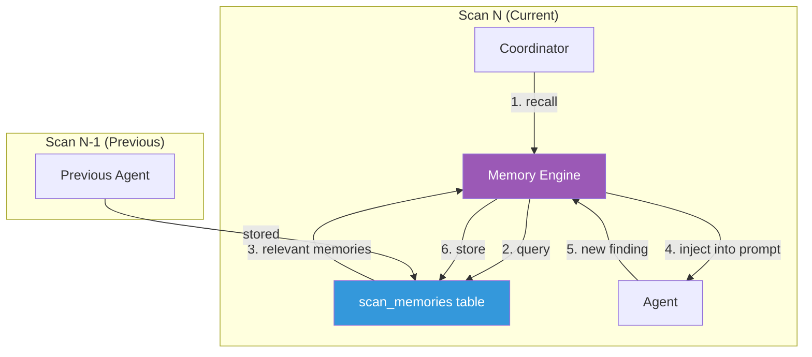
```mermaid
graph TD
    subgraph "Scan N (Current)"
        Coord["Coordinator"] -->|1. recall| ME["Memory Engine"]
        ME -->|2. query| PG["scan_memories table"]
        PG -->|3. relevant memories| ME
        ME -->|4. inject into prompt| Agent["Agent"]
        Agent -->|5. new finding| ME
        ME -->|6. store| PG
    end

    subgraph "Scan N-1 (Previous)"
        PrevAgent["Previous Agent"] -->|stored| PG
    end

    style ME fill:#9b59b6,color:#fff
    style PG fill:#3498db,color:#fff
```

### Memory Types

| Type | Description | Example |
|------|-------------|---------|
| `finding` | Previously discovered vulnerability | "SQLi at /api/login via `id` parameter" |
| `technique` | Effective attack technique | "WAF bypass: double URL encoding" |
| `target_info` | Infrastructure knowledge | "Runs nginx/1.18, PHP 8.1, MySQL 8.0" |
| `tool_output` | Key tool results | "Nuclei found 3 CVEs in jQuery 3.4.1" |

### Memory Schema

```sql
CREATE TABLE scan_memories (
    id SERIAL PRIMARY KEY,
    project_id INTEGER REFERENCES projects(id),
    target_url VARCHAR(500) NOT NULL,
    memory_type VARCHAR(20) NOT NULL,
    title VARCHAR(200) NOT NULL,
    content TEXT NOT NULL,
    source_scan_id INTEGER REFERENCES scans(id),
    severity VARCHAR(20),
    confidence FLOAT,
    created_at TIMESTAMP DEFAULT NOW(),
    last_verified_at TIMESTAMP,
    is_stale BOOLEAN DEFAULT FALSE
);
```

### Freshness System

Memories include age-based freshness warnings when injected into agent prompts:

| Age | Note |
|-----|------|
| ≤ 1 day | *(none — fresh)* |
| 2-7 days | ⚠️ "This memory is N days old. Verify against current scan data." |
| 8-30 days | ⚠️ "This memory is N days old. Target may have changed." |
| 30+ days | ⚠️ "This memory is N days old. Treat as unverified." |

### Memory Engine API

```python
class MemoryEngine:
    async def store(project_id, target_url, memory_type, title, content, ...)
    async def recall(project_id, target_url, query, max_memories=5)
    async def get_target_history(target_url)
    async def mark_stale(memory_id)
    async def consolidate(scan_id)  # Post-scan memory extraction
```

---

## 8. Skill System (Progressive Disclosure)

The skill system follows the **Agent Skills specification** (agentskills.io) with 3-level progressive disclosure:

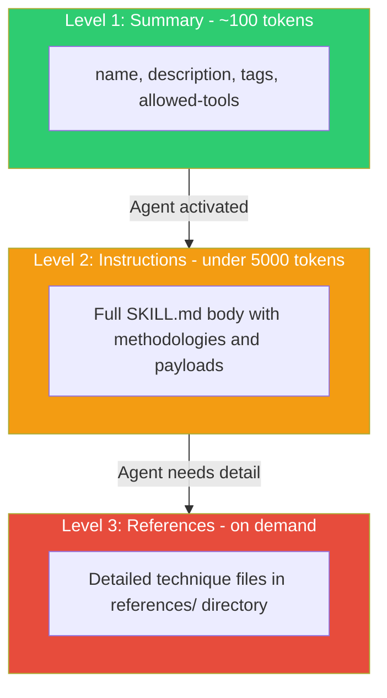
```mermaid
graph TD
    subgraph Level1["Level 1: Summary - ~100 tokens"]
        S1["name, description, tags, allowed-tools"]
    end

    subgraph Level2["Level 2: Instructions - under 5000 tokens"]
        S2["Full SKILL.md body with methodologies and payloads"]
    end

    subgraph Level3["Level 3: References - on demand"]
        S3["Detailed technique files in references/ directory"]
    end

    Level1 -->|Agent activated| Level2
    Level2 -->|Agent needs detail| Level3

    style Level1 fill:#2ecc71,color:#fff
    style Level2 fill:#f39c12,color:#fff
    style Level3 fill:#e74c3c,color:#fff
```

### Skill Loading Flow

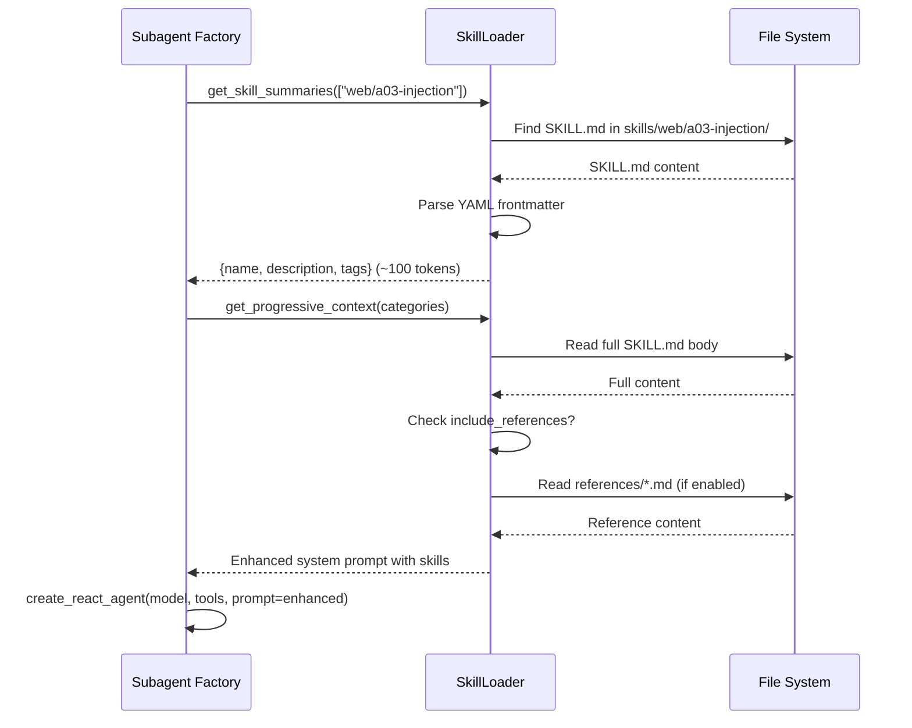
```mermaid
sequenceDiagram
    participant SA as Subagent Factory
    participant SL as SkillLoader
    participant FS as File System

    SA->>SL: get_skill_summaries(["web/a03-injection"])
    SL->>FS: Find SKILL.md in skills/web/a03-injection/
    FS-->>SL: SKILL.md content
    SL->>SL: Parse YAML frontmatter
    SL-->>SA: {name, description, tags} (~100 tokens)

    SA->>SL: get_progressive_context(categories)
    SL->>FS: Read full SKILL.md body
    FS-->>SL: Full content
    SL->>SL: Check include_references?
    SL->>FS: Read references/*.md (if enabled)
    FS-->>SL: Reference content
    SL-->>SA: Enhanced system prompt with skills

    SA->>SA: create_react_agent(model, tools, prompt=enhanced)
```

### Skill Inventory

| Category | Skills | References | Coverage |
|----------|--------|------------|----------|
| `web/` | 11 SKILL.md | 25+ refs | OWASP A01–A10, XSS, API, File Attacks |
| `network/` | 8 SKILL.md | 30+ refs | Databases, containers, email, wireless, ICS/IoT |
| `injection/` | 7 SKILL.md | — | XSS, SQLi, SSRF, SSTI, XXE, RCE, LFI |
| `authentication/` | 2 SKILL.md | — | IDOR, JWT attacks |
| `configuration/` | 2 SKILL.md | — | CORS, security headers |
| `mobile/` | 3 SKILL.md | 3 refs | Android, iOS pentesting |
| `active-directory/` | varies | varies | AD attack techniques |
| `exploitation/` | 1 file | — | PoC templates |
| `logic/` | 1 SKILL.md | — | Race conditions |
| `reconnaissance/` | 1 file | — | Subdomain enumeration |
| `vulnerabilities/` | 4 files | — | XSS, SQLi, SSRF, IDOR testing guides |
| **Total** | **46 SKILL.md** | **113 references** | — |

---

## 9. LLM Router (Multi-Provider)

The `LLMRouter` class provides **per-agent model routing** — each of the 12 subagents can use a different LLM provider and model.

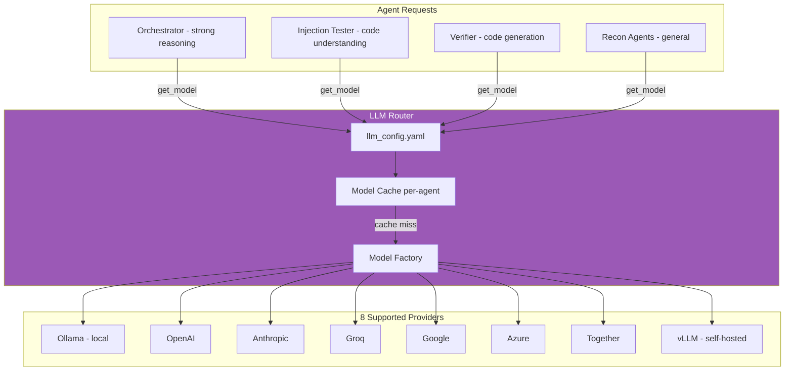
```mermaid
graph TD
    subgraph Agents["Agent Requests"]
        O["Orchestrator - strong reasoning"]
        IT["Injection Tester - code understanding"]
        V["Verifier - code generation"]
        R["Recon Agents - general"]
    end

    subgraph Router["LLM Router"]
        Config["llm_config.yaml"]
        Cache["Model Cache per-agent"]
        Factory["Model Factory"]
    end

    subgraph Providers["8 Supported Providers"]
        Ollama["Ollama - local"]
        OpenAI["OpenAI"]
        Anthropic["Anthropic"]
        Groq["Groq"]
        Google["Google"]
        Azure["Azure"]
        Together["Together"]
        VLLM["vLLM - self-hosted"]
    end

    O -->|get_model| Config
    IT -->|get_model| Config
    V -->|get_model| Config
    R -->|get_model| Config

    Config --> Cache
    Cache -->|cache miss| Factory
    Factory --> Ollama
    Factory --> OpenAI
    Factory --> Anthropic
    Factory --> Groq
    Factory --> Google
    Factory --> Azure
    Factory --> Together
    Factory --> VLLM

    style Router fill:#9b59b6,color:#fff
```

### Configuration Resolution

```
1. Check agents.{agent_type} in llm_config.yaml
2. If not found, use default config
3. Merge agent config with defaults (agent overrides default)
4. Resolve ${ENV_VAR} references in api_key fields
5. Create provider-specific ChatModel (ChatOllama, ChatOpenAI, etc.)
6. Cache model instance for reuse
```

### Recommended Model Selection

| Task Type | Recommended Models | Why |
|-----------|-------------------|-----|
| **Orchestrator** | qwen2.5:14b, gpt-4o, claude-3-sonnet | Needs strong reasoning for planning |
| **Injection/Verifier** | qwen2.5-coder:14b, gpt-4o | Needs code understanding for payload crafting |
| **Recon/Discovery** | mistral:7b, qwen2.5:7b | Simpler tasks, faster models sufficient |
| **Reporter** | qwen2.5:7b | Text generation, any capable model works |

---

## 10. Tool Execution Pipeline

All security tools execute inside the Kali Linux Docker container. The pipeline:

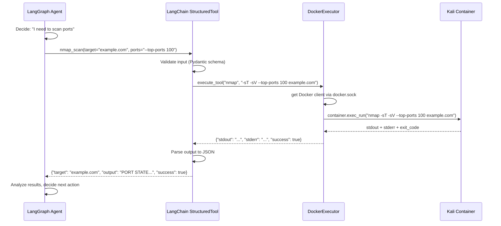
```mermaid
sequenceDiagram
    participant Agent as LangGraph Agent
    participant Tool as LangChain StructuredTool
    participant Exec as DockerExecutor
    participant Kali as Kali Container

    Agent->>Agent: Decide: "I need to scan ports"
    Agent->>Tool: nmap_scan(target="example.com", ports="--top-ports 100")
    Tool->>Tool: Validate input (Pydantic schema)
    Tool->>Exec: execute_tool("nmap", "-sT -sV --top-ports 100 example.com")
    Exec->>Exec: get Docker client via docker.sock
    Exec->>Kali: container.exec_run("nmap -sT -sV --top-ports 100 example.com")
    Kali-->>Exec: stdout + stderr + exit_code
    Exec-->>Tool: {"stdout": "...", "stderr": "...", "success": true}
    Tool->>Tool: Parse output to JSON
    Tool-->>Agent: {"target": "example.com", "output": "PORT STATE...", "success": true}
    Agent->>Agent: Analyze results, decide next action
```

### DockerExecutor Details

- **Connection**: Unix socket `/var/run/docker.sock` mounted into the app container
- **Container lookup**: By name (`KALI_CONTAINER_NAME` env var, default: `redstrike-kali`)
- **Execution**: `container.exec_run(cmd)` — synchronous execution, captures stdout/stderr
- **Timeout**: Configurable per-tool (long-running tools like sqlmap need higher limits)
- **Wordlists**: Mapped to `/wordlists/SecLists/...` paths inside the Kali container

### Tool Categories

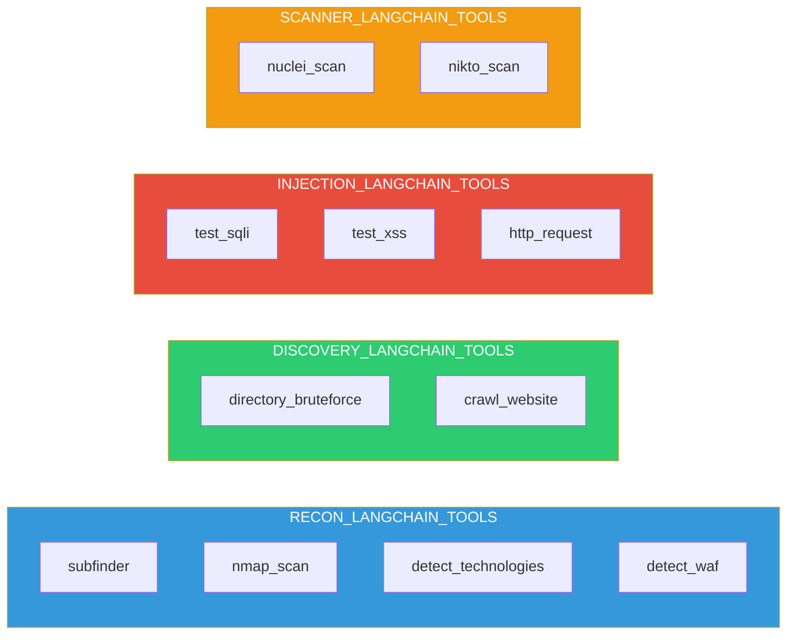
```mermaid
graph LR
    subgraph Recon["RECON_LANGCHAIN_TOOLS"]
        T1["subfinder"]
        T2["nmap_scan"]
        T3["detect_technologies"]
        T4["detect_waf"]
    end

    subgraph Discovery["DISCOVERY_LANGCHAIN_TOOLS"]
        T5["directory_bruteforce"]
        T6["crawl_website"]
    end

    subgraph Injection["INJECTION_LANGCHAIN_TOOLS"]
        T7["test_sqli"]
        T8["test_xss"]
        T9["http_request"]
    end

    subgraph Scanner["SCANNER_LANGCHAIN_TOOLS"]
        T10["nuclei_scan"]
        T11["nikto_scan"]
    end

    style Recon fill:#3498db,color:#fff
    style Discovery fill:#2ecc71,color:#fff
    style Injection fill:#e74c3c,color:#fff
    style Scanner fill:#f39c12,color:#fff
```

---

## 11. Database Schema

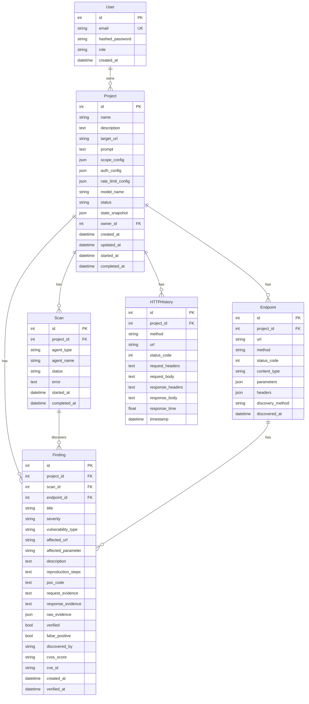
```mermaid
erDiagram
    User {
        int id PK
        string email UK
        string hashed_password
        string role
        datetime created_at
    }

    Project {
        int id PK
        string name
        text description
        string target_url
        text prompt
        json scope_config
        json auth_config
        json rate_limit_config
        string model_name
        string status
        json state_snapshot
        int owner_id FK
        datetime created_at
        datetime updated_at
        datetime started_at
        datetime completed_at
    }

    Scan {
        int id PK
        int project_id FK
        string agent_type
        string agent_name
        string status
        text error
        datetime started_at
        datetime completed_at
    }

    Finding {
        int id PK
        int project_id FK
        int scan_id FK
        int endpoint_id FK
        string title
        string severity
        string vulnerability_type
        string affected_url
        string affected_parameter
        text description
        text reproduction_steps
        text poc_code
        text request_evidence
        text response_evidence
        json raw_evidence
        bool verified
        bool false_positive
        string discovered_by
        string cvss_score
        string cve_id
        datetime created_at
        datetime verified_at
    }

    Endpoint {
        int id PK
        int project_id FK
        string url
        string method
        int status_code
        string content_type
        json parameters
        json headers
        string discovery_method
        datetime discovered_at
    }

    HTTPHistory {
        int id PK
        int project_id FK
        string method
        string url
        int status_code
        text request_headers
        text request_body
        text response_headers
        text response_body
        float response_time
        datetime timestamp
    }

    User ||--o{ Project : owns
    Project ||--o{ Scan : has
    Project ||--o{ Finding : has
    Project ||--o{ Endpoint : has
    Project ||--o{ HTTPHistory : has
    Scan ||--o{ Finding : discovers
    Endpoint ||--o{ Finding : has
```

### Key Design Notes

- **`state_snapshot`** (JSON): Stores the LangGraph `ScanState` for pause/resume. When a scan is paused, the current phase index and plan are serialized here.
- **`scope_config`** (JSON): Stores allowed domains, excluded paths, extracted from the user's natural language prompt by the orchestrator.
- **Cascade deletes**: Deleting a project cascades to scans, findings, endpoints, and HTTP history.
- **Finding verification**: Two booleans — `verified` (confirmed by verifier agent) and `false_positive` (manually marked by user).

---

## 12. API Layer

### Architecture

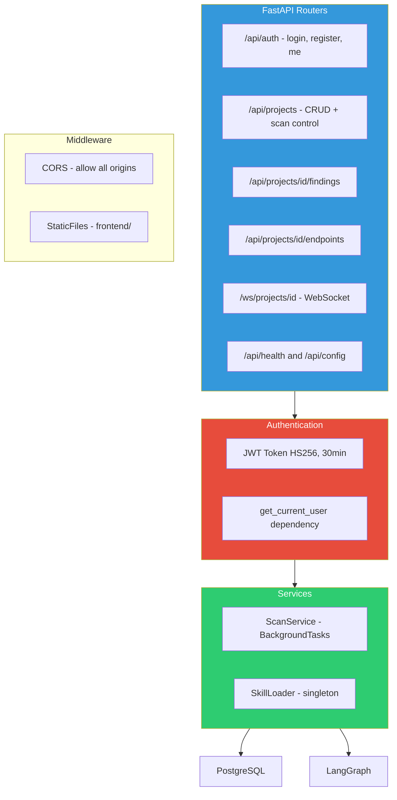
```mermaid
graph TD
    subgraph Routes["FastAPI Routers"]
        Auth["/api/auth - login, register, me"]
        Projects["/api/projects - CRUD + scan control"]
        Findings["/api/projects/id/findings"]
        Endpoints["/api/projects/id/endpoints"]
        WS["/ws/projects/id - WebSocket"]
        Health["/api/health and /api/config"]
    end

    subgraph Middleware["Middleware"]
        CORS["CORS - allow all origins"]
        StaticFiles["StaticFiles - frontend/"]
    end

    subgraph Auth_Layer["Authentication"]
        JWT["JWT Token HS256, 30min"]
        Deps["get_current_user dependency"]
    end

    subgraph Services["Services"]
        ScanSvc["ScanService - BackgroundTasks"]
        SkillSvc["SkillLoader - singleton"]
    end

    Routes --> Auth_Layer
    Auth_Layer --> Services
    Services --> DB["PostgreSQL"]
    Services --> AgentGraph["LangGraph"]

    style Routes fill:#3498db,color:#fff
    style Auth_Layer fill:#e74c3c,color:#fff
    style Services fill:#2ecc71,color:#fff
```

### Authentication Flow

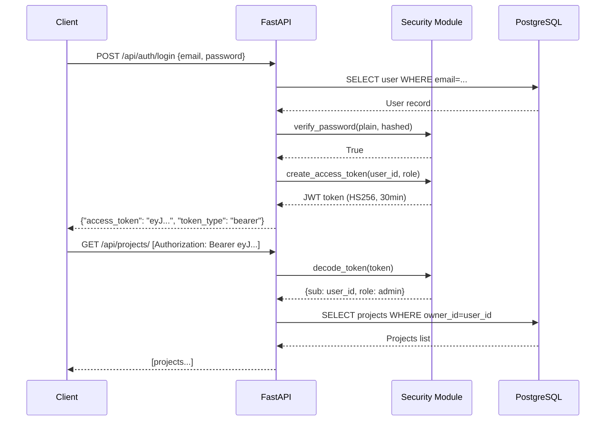
```mermaid
sequenceDiagram
    participant Client
    participant API as FastAPI
    participant Security as Security Module
    participant DB as PostgreSQL

    Client->>API: POST /api/auth/login {email, password}
    API->>DB: SELECT user WHERE email=...
    DB-->>API: User record
    API->>Security: verify_password(plain, hashed)
    Security-->>API: True
    API->>Security: create_access_token(user_id, role)
    Security-->>API: JWT token (HS256, 30min)
    API-->>Client: {"access_token": "eyJ...", "token_type": "bearer"}

    Client->>API: GET /api/projects/ [Authorization: Bearer eyJ...]
    API->>Security: decode_token(token)
    Security-->>API: {sub: user_id, role: admin}
    API->>DB: SELECT projects WHERE owner_id=user_id
    DB-->>API: Projects list
    API-->>Client: [projects...]
```

---

## 13. Real-time Communication

### WebSocket Architecture

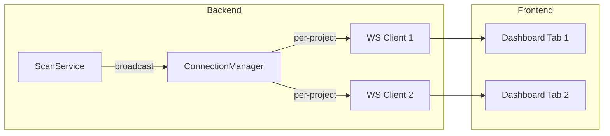
```mermaid
graph LR
    subgraph Backend
        ScanSvc["ScanService"] -->|broadcast| CM["ConnectionManager"]
        CM -->|per-project| WS1["WS Client 1"]
        CM -->|per-project| WS2["WS Client 2"]
    end

    subgraph Frontend
        WS1 --> Dashboard1["Dashboard Tab 1"]
        WS2 --> Dashboard2["Dashboard Tab 2"]
    end
```

The `ConnectionManager` maintains a `Dict[int, Set[WebSocket]]` — mapping project IDs to connected WebSocket clients. Events are broadcast to all clients watching a specific project.

### Event Types

| Event | Payload | Trigger |
|-------|---------|---------|
| `scan_update` | `{phase, status, message, data}` | Phase start/complete/error |
| `new_finding` | `{id, title, severity}` | Finding saved to database |
| `new_endpoint` | `{url, method, status_code}` | Endpoint discovered |
| `scan_complete` | `{findings, endpoints, duration}` | All phases complete |
| `ping`/`pong` | — | Keep-alive |

### Fallback: Async Polling

If WebSocket disconnects, the frontend can poll `GET /api/projects/{id}/status`:

```json
{
  "project_id": 1,
  "project_status": "running",
  "scan_progress": {
    "phase": "injection_testing",
    "phase_index": 3,
    "total_phases": 5,
    "status": "running",
    "message": "Running injection_testing...",
    "progress_percent": 60,
    "started_at": "2026-04-01T10:00:00",
    "updated_at": "2026-04-01T10:05:30"
  }
}
```

---

## 14. Scan Lifecycle & Data Flow

### End-to-End Data Flow

```mermaid
sequenceDiagram
    participant User
    participant API as FastAPI
    participant Orch as Orchestrator
    participant Graph as StateGraph
    participant Sub as Subagents
    participant Kali as Kali Container
    participant DB as PostgreSQL
    participant WS as WebSocket

    User->>API: POST /api/projects/ {name, prompt}
    API->>Orch: parse_prompt(prompt)
    Orch->>Orch: LLM extracts target, scope, auth, rate_limit
    Orch-->>API: {target_url, scope, auth, rate_limit}
    API->>DB: INSERT project
    API-->>User: Project created (status: pending)

    User->>API: POST /api/projects/{id}/start
    API->>API: BackgroundTasks.add_task(scan_service.run_scan)
    API-->>User: {"message": "Scan started"}

    Note over API,WS: Background execution begins

    API->>Orch: create_attack_plan(config)
    Orch-->>API: [recon, discovery, scanning, fuzzing, verification]
    API->>WS: broadcast("planning", "Creating attack plan...")

    loop For each phase in plan
        API->>DB: INSERT scan record
        API->>WS: broadcast("phase_name", "Starting...")
        API->>Sub: run_subagent(agent_type, state)
        Sub->>Kali: execute_tool(tool, args)
        Kali-->>Sub: stdout/stderr
        Sub-->>API: {findings, endpoints}
        API->>DB: INSERT findings, endpoints
        API->>WS: broadcast(new_finding / new_endpoint)
        API->>DB: UPDATE scan status
    end

    API->>DB: UPDATE project status = completed
    API->>WS: broadcast("scan_complete", summary)
```

### Pause/Resume Flow

```mermaid
sequenceDiagram
    participant User
    participant API
    participant ScanSvc as ScanService
    participant DB

    User->>API: POST /projects/{id}/pause
    API->>DB: UPDATE project SET status='paused'
    Note over ScanSvc: Next phase check sees status=PAUSED
    ScanSvc->>DB: SAVE state_snapshot (current phase index + plan)
    ScanSvc->>API: Return (scan loop exits)

    User->>API: POST /projects/{id}/start (resume)
    API->>DB: UPDATE project SET status='running'
    API->>ScanSvc: run_scan(project_id)
    ScanSvc->>DB: LOAD state_snapshot
    Note over ScanSvc: Resume from saved phase index
```

---

## 15. Security Design

### Threat Model

| Threat | Mitigation |
|--------|-----------|
| **Unauthorized access** | JWT authentication on all API endpoints, WebSocket auth via token query param |
| **Tool escape** | All tools execute in isolated Kali Docker container, not on host |
| **Scope violation** | Orchestrator extracts scope from prompt, agents check scope before tool execution |
| **Credential exposure** | Admin password auto-generated on first run, JWT secret configurable |
| **Data leakage** | Projects owned per-user, all queries filter by `owner_id` |
| **Docker socket access** | Only the app container has docker.sock access (required for tool execution) |

### Authentication & Authorization

- **JWT tokens**: HS256 algorithm, 30-minute access token, 7-day refresh token
- **User roles**: `admin` and `user` (admin can register new users)
- **Per-user isolation**: All project/finding queries filtered by `owner_id`
- **Password hashing**: bcrypt via passlib

### Container Isolation

```
Host OS
└── Docker Network (redstrike-network, bridge mode)
    ├── redstrike-app    — Only has docker.sock + DB access
    ├── redstrike-db     — Only accessible within Docker network
    └── redstrike-kali   — Privileged (needed for nmap), but:
                           • No port mapping to host
                           • No docker.sock access
                           • Read-only skills mount
                           • Only accessed via exec_run()
```

---

## 16. Distributed Architecture

### Celery + Redis

```mermaid
graph LR
    subgraph "FastAPI Process"
        API["API"] -->|submit| CeleryClient["Celery Client"]
    end

    subgraph "Redis"
        Broker["Task Broker"]
        PubSub["Pub/Sub Channels"]
    end

    subgraph "Worker Pool (scalable)"
        W1["Worker 1"]
        W2["Worker 2"]
        WN["Worker N"]
    end

    CeleryClient -->|task| Broker
    Broker -->|dispatch| W1
    Broker -->|dispatch| W2
    Broker -->|dispatch| WN
    W1 -->|agent events| PubSub
    W2 -->|agent events| PubSub
    PubSub -->|WebSocket| API

    style Broker fill:#d63031,color:#fff
    style PubSub fill:#d63031,color:#fff
```

**Scaling**: `docker compose up --scale celery-worker=3` adds more worker nodes. Each worker can execute up to 50 concurrent agent tasks.

---

## 17. Frontend Architecture

The frontend is a **React + Vite + TypeScript SPA** with enterprise-grade design.

```
frontend/
├── src/
│   ├── components/
│   │   ├── AgentGraph/         # Live agent tree (React Flow)
│   │   ├── FindingsTable/      # Sortable findings with severity badges
│   │   ├── ScanControl/        # Start/pause/cancel buttons
│   │   ├── MemoryViewer/       # Target scan history
│   │   └── Layout/             # Sidebar, header, navigation
│   ├── pages/
│   │   ├── Login.tsx
│   │   ├── Projects.tsx
│   │   ├── ProjectDetail.tsx   # Agent graph + findings + scan log
│   │   └── Settings.tsx
│   ├── hooks/
│   │   ├── useWebSocket.ts     # Real-time agent updates
│   │   └── useAgentGraph.ts    # Agent tree state management
│   ├── api/
│   │   └── client.ts           # React Query + fetch wrapper
│   └── App.tsx
├── index.html
├── vite.config.ts
└── package.json
```

### Key Libraries

| Library | Purpose |
|---------|----------|
| `react-router-dom` | Client-side routing |
| `@tanstack/react-query` | Server state management + caching |
| `@xyflow/react` | Live agent graph visualization |
| `recharts` | Severity donut charts, trends |
| `framer-motion` | Micro-animations |
| `lucide-react` | Icons |

---

## 18. Federation Roadmap

RedStrike.AI is designed to be **federation-ready** — multiple instances across regions can register, communicate, and delegate scans.

```mermaid
graph TB
    RS1["RedStrike US-East"] <-->|Federation API| RS2["RedStrike EU-West"]
    RS2 <-->|Federation API| RS3["RedStrike APAC"]
    RS1 <-->|Federation API| RS3

    style RS1 fill:#e74c3c,color:#fff
    style RS2 fill:#e74c3c,color:#fff
    style RS3 fill:#e74c3c,color:#fff
```

**Phase 1** (current): Single-instance, single-organization deployment.  
**Phase 2** (future): Multi-instance federation with scan delegation and shared memory.

---

## 19. Key Design Decisions

| Decision | Rationale |
|----------|-----------|
| **Dynamic agents over fixed agents** | Target complexity varies wildly — a 5-page blog needs 12 agents, a 200-endpoint SaaS needs 150+. Static graphs can't adapt. |
| **Celery + Redis over asyncio-only** | Horizontal scaling. Single-process asyncio caps at one machine. Celery workers can be scaled across nodes. |
| **PostgreSQL for agent registry** | Enterprise auditability. Every agent spawn, status change, and result is persisted and queryable. |
| **PostgreSQL for memory** | Central, enterprise-compliant storage. Memories persist across scans, users, and restarts. No file-system dependency. |
| **Per-scan Kali containers** | Multi-user isolation. User A's scan can't interfere with User B's. Each scan gets a clean environment. |
| **React + Vite** | Enterprise frontend needs component architecture, real-time agent graph (React Flow), and proper state management. |
| **Federation-ready stubs** | Architecture designed from day 1 for multi-location deployment. API stubs exist; implementation is incremental. |
| **LangGraph preserved** | `create_react_agent` is still the core agent primitive. We changed orchestration (static → dynamic), not the agent engine. |
| **Per-agent LLM routing** | Different tasks need different model strengths — use a strong coder for injection testing, a fast model for recon |
| **Skills as SKILL.md files** | Follows the agentskills.io standard, easy for non-developers to contribute knowledge |
| **Two-step verification** | Reduces false positives — all findings go through a dedicated verifier agent before being reported |
| **WebSocket + polling** | WebSocket for real-time agent graph updates, polling as fallback for reliability |

---

<p align="center">
  <strong>RedStrike.AI</strong> — Built with LangGraph Deep Agents 🧠
</p>
