# RedStrike.AI — System Architecture

> Detailed architecture document for RedStrike.AI, an autonomous penetration testing platform built on the **LangGraph Deep Agents** framework.

**Version:** 1.0.0  
**Last Updated:** April 2026  
**Author:** Omkar Ukirde

---

## Table of Contents

1. [System Overview](#1-system-overview)
2. [Technology Stack](#2-technology-stack)
3. [Deployment Topology](#3-deployment-topology)
4. [LangGraph Deep Agent Architecture](#4-langgraph-deep-agent-architecture)
5. [StateGraph & Conditional Routing](#5-stategraph--conditional-routing)
6. [Subagent Breakdown](#6-subagent-breakdown)
7. [Skill System (Progressive Disclosure)](#7-skill-system-progressive-disclosure)
8. [LLM Router (Multi-Provider)](#8-llm-router-multi-provider)
9. [Tool Execution Pipeline](#9-tool-execution-pipeline)
10. [Database Schema](#10-database-schema)
11. [API Layer](#11-api-layer)
12. [Real-time Communication](#12-real-time-communication)
13. [Scan Lifecycle & Data Flow](#13-scan-lifecycle--data-flow)
14. [Security Design](#14-security-design)
15. [Frontend Architecture](#15-frontend-architecture)
16. [Key Design Decisions](#16-key-design-decisions)

---

## 1. System Overview

RedStrike.AI is a **3-container microservice** application that automates web penetration testing using AI agents. A user provides a natural language prompt ("Test example.com for SQL injection and XSS"), and the system:

1. **Parses** the prompt to extract target URL, scope, authentication, and rate limits
2. **Plans** an attack strategy across 5 testing phases
3. **Executes** 30+ security tools in an isolated Kali Linux container
4. **Verifies** findings with a two-step verification process and PoC generation
5. **Reports** results with reproduction steps and Python exploit code

```mermaid
graph TB
    User["👤 User<br/>(Browser)"] -->|REST + WebSocket| App["🖥️ FastAPI App<br/>(Port 9000)"]
    App -->|SQL| DB["🗄️ PostgreSQL<br/>(Port 5432)"]
    App -->|Docker SDK<br/>exec_run()| Kali["🐉 Kali Linux<br/>(30+ Tools)"]
    App -->|HTTP| LLM["🧠 LLM Provider<br/>(Ollama/OpenAI/...)"]
    App -->|File I/O| Skills["📚 Skills<br/>(46 SKILL.md files)"]

    style App fill:#e74c3c,color:#fff
    style DB fill:#3498db,color:#fff
    style Kali fill:#2ecc71,color:#fff
    style LLM fill:#9b59b6,color:#fff
    style Skills fill:#f39c12,color:#fff
```

---

## 2. Technology Stack

| Layer | Technology | Purpose |
|-------|-----------|---------|
| **Web Framework** | FastAPI 0.115+ | Async REST API + WebSocket + static file serving |
| **Agent Framework** | LangGraph 0.2+ | Deep Agents — `StateGraph`, `create_react_agent`, conditional routing |
| **LLM Integration** | LangChain Core 0.3+ | Tool bindings, message types, chat model abstractions |
| **LLM Providers** | LangChain-Ollama/OpenAI/Anthropic/Groq/Google | Provider-specific ChatModel implementations |
| **Database** | PostgreSQL 16 + SQLAlchemy 2.0 (async) | Persistent storage with `asyncpg` driver |
| **Auth** | python-jose + passlib (bcrypt) | JWT-based authentication |
| **Tool Execution** | Docker SDK (Python) | Execute commands in Kali container via `docker.sock` |
| **Proxy** | mitmproxy 10.2+ | HTTP request/response interception (planned) |
| **Frontend** | Vanilla HTML/CSS/JS | Single-page dashboard served as static files |
| **Containerization** | Docker Compose | 3-container orchestration |

### Python Dependencies (Key)

```
langgraph>=0.2.0          # Deep Agent orchestration
langchain-core>=0.3.0     # LLM abstractions
langchain-ollama>=0.2.0   # Ollama provider
langchain-openai>=0.2.0   # OpenAI/Azure/vLLM/Together
langchain-anthropic>=0.2.0
langchain-groq>=0.2.0
langchain-google-genai>=2.0.0
fastapi>=0.115.2
sqlalchemy[asyncio]>=2.0.25
docker>=7.0.0
litellm>=1.55.0
```

---

## 3. Deployment Topology

```mermaid
graph LR
    subgraph Docker["Docker Compose Network (redstrike-network)"]
        subgraph AppContainer["redstrike-app"]
            FastAPI["FastAPI<br/>:9000"]
            AgentGraph["LangGraph<br/>Deep Agents"]
            SkillLoader["Skill Loader"]
            DockerExec["Docker Executor"]
        end

        subgraph DBContainer["redstrike-db"]
            Postgres["PostgreSQL 16<br/>:5432"]
        end

        subgraph KaliContainer["redstrike-kali"]
            Tools["nmap, nuclei,<br/>sqlmap, ffuf,<br/>dalfox, katana,<br/>nikto, subfinder..."]
            SecLists["SecLists<br/>Wordlists"]
        end
    end

    Host["Host Machine"] -->|:9000| FastAPI
    Host -->|:5432| Postgres
    FastAPI -->|asyncpg| Postgres
    DockerExec -->|docker.sock<br/>exec_run()| KaliContainer
    AgentGraph -->|HTTP| LLM["LLM Provider<br/>(localhost:11434<br/>or cloud API)"]

    style AppContainer fill:#e74c3c,color:#fff
    style DBContainer fill:#3498db,color:#fff
    style KaliContainer fill:#27ae60,color:#fff
```

### Volume Mounts

| Container | Mount | Purpose |
|-----------|-------|---------|
| `redstrike-app` | `.:/app` | Application code (hot-reload) |
| `redstrike-app` | `./skills:/app/skills` | Skill files |
| `redstrike-app` | `/var/run/docker.sock` | Docker SDK access to Kali container |
| `redstrike-db` | `postgres_data:/var/lib/postgresql/data` | Persistent database storage |
| `redstrike-kali` | `kali_data:/data` | Tool output storage |
| `redstrike-kali` | `./skills:/skills:ro` | Read-only skill files |

---

## 4. LangGraph Deep Agent Architecture

RedStrike uses the **LangGraph Deep Agents** pattern — a hierarchical multi-agent system where:

- The **Orchestrator** is the entry point that plans and coordinates
- **12 Subagents** are specialized `create_react_agent` instances
- A **StateGraph** manages state flow and conditional phase transitions
- **pre_model_hook** handles context window management
- **Skills** are injected into system prompts using progressive disclosure

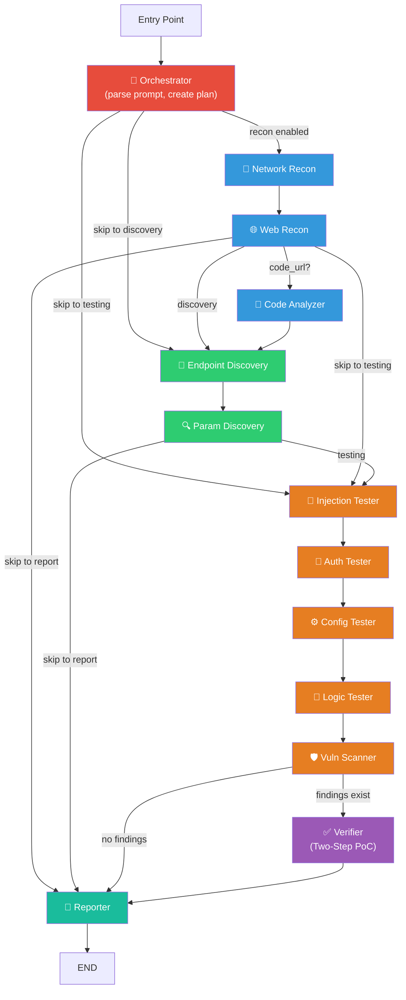

### Why Deep Agents?

| Traditional Approach | Deep Agents Approach (RedStrike) |
|---------------------|----------------------------------|
| Single monolithic agent with all tools | Orchestrator delegates to specialized subagents |
| One shared context window | Each subagent has its own context with `pre_model_hook` trimming |
| All knowledge loaded at once | Progressive disclosure loads skills on demand |
| One model for everything | Per-agent LLM routing — right model for the right task |
| No state persistence | `ScanState` TypedDict enables pause/resume |

---

## 5. StateGraph & Conditional Routing

### ScanState Schema

The `ScanState` TypedDict is the central data structure flowing through all agents:

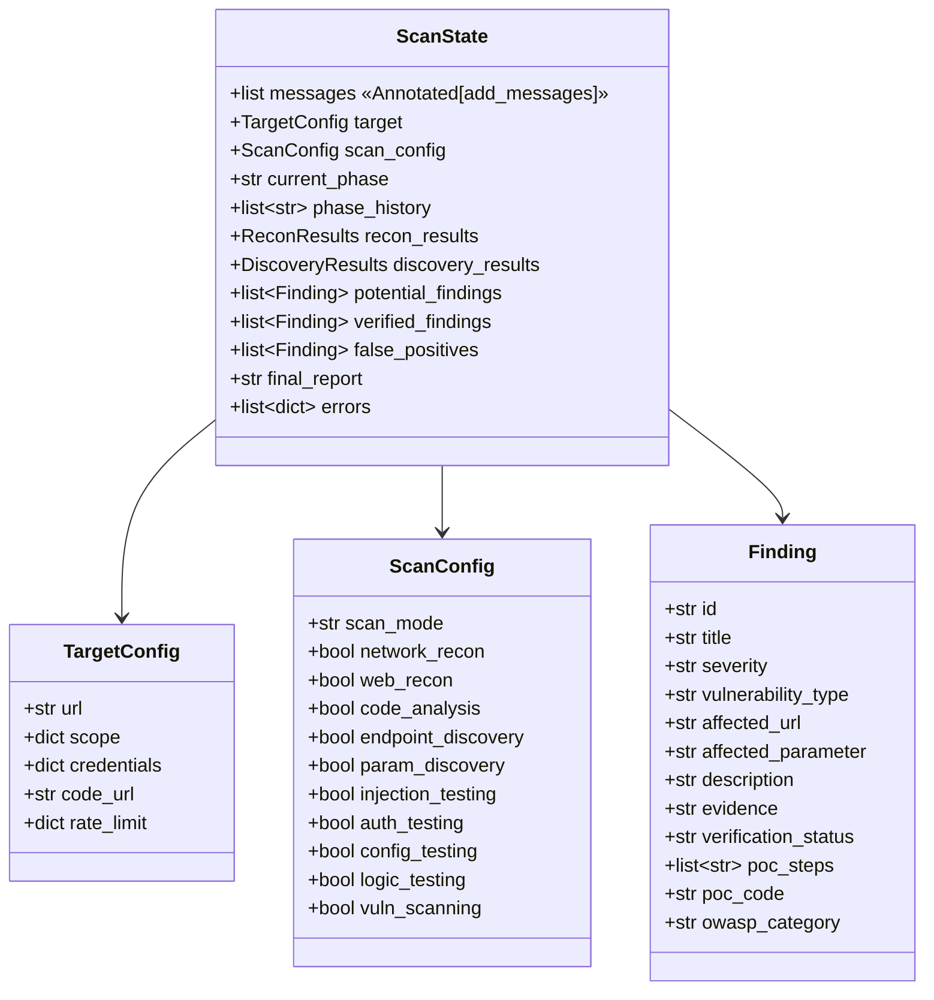

### Conditional Routing Logic

The graph uses **conditional edges** to skip phases dynamically:

```python
# From orchestrator — choose first phase
orchestrator → [recon?] → network_recon
             → [discovery?] → endpoint_discovery
             → [testing?] → injection_tester

# From web_recon — choose next phase
web_recon → [code_url?] → code_analyzer
          → [discovery?] → endpoint_discovery
          → [testing?] → injection_tester
          → reporter  # skip everything

# From vuln_scanner — verification gate
vuln_scanner → [findings?] → verifier
             → reporter  # no findings to verify
```

Each routing function inspects the `ScanConfig` booleans to determine which phases to run. This means a user can configure a scan to run only reconnaissance, or only injection testing, and the graph adapts.

### Scan Modes

| Mode | Description | Enables |
|------|-------------|---------|
| **Blackbox** | No credentials, no source code | All external testing phases |
| **Greybox** | Credentials provided | Blackbox + authenticated testing |
| **Whitebox** | Credentials + source code URL | Greybox + code_analyzer subagent |

---

## 6. Subagent Breakdown

Each subagent is created by the `create_skill_aware_subagent()` factory:

```python
agent = create_skill_aware_subagent(
    model=get_model_for_agent("injection_tester"),  # Per-agent model
    tools=INJECTION_LANGCHAIN_TOOLS,                # LangChain tools
    skill_categories=["web/a03-injection", "injection"],  # Skill context
    base_prompt=INJECTION_TESTER_PROMPT,            # Role-specific prompt
    max_context_messages=20,                         # Context window limit
)
```

### Subagent Details

| Subagent | Model (Default) | Tools | Skills | Output |
|----------|----------------|-------|--------|--------|
| `network_recon` | mistral:7b | subfinder, nmap, httpx | network/reconnaissance | Subdomains, ports, services |
| `web_recon` | mistral:7b | whatweb, wafw00f | network/recon, web/a05, configuration | Technologies, WAF, headers |
| `code_analyzer` | qwen2.5-coder:14b | — | web/a03-injection, web/a08 | Code vulnerabilities (whitebox) |
| `endpoint_discovery` | mistral:7b | ffuf, katana, gobuster | reconnaissance | Directories, endpoints, URLs |
| `param_discovery` | mistral:7b | arjun, paramspider | reconnaissance | Hidden params, API endpoints |
| `injection_tester` | qwen2.5-coder:14b | sqlmap, dalfox, curl | web/a03, web/xss, injection | XSS, SQLi, SSRF, XXE, RCE, SSTI |
| `auth_tester` | qwen2.5:7b | curl | web/a07, web/a01, authentication | IDOR, auth bypass, JWT, sessions |
| `config_tester` | qwen2.5:7b | curl | web/a05, configuration | Misconfigs, headers, SSL |
| `logic_tester` | qwen2.5:7b | curl | web/a04, logic | Business logic, race conditions |
| `vuln_scanner` | mistral:7b | nuclei, nikto | web/a06, vulnerabilities | CVEs, known vulns |
| `verifier` | qwen2.5-coder:20b | curl, sqlmap, dalfox | exploitation | Verified findings + PoC code |
| `reporter` | qwen2.5:7b | — | — | Markdown report |

### Context Window Management

Each subagent uses a `pre_model_hook` to prevent context overflow:

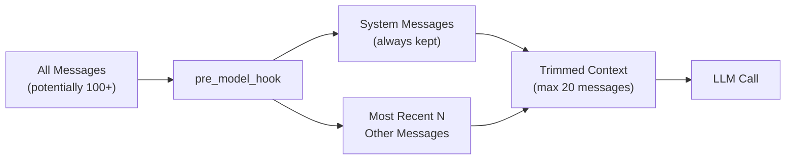

This is critical because security tool outputs can be very large (nmap scans, nuclei results). The hook ensures the agent never exceeds its context window while preserving the system prompt with skill knowledge.

---

## 7. Skill System (Progressive Disclosure)

The skill system follows the **Agent Skills specification** (agentskills.io) with 3-level progressive disclosure:

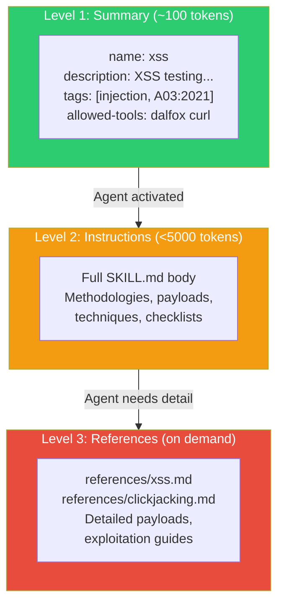

### Skill Loading Flow

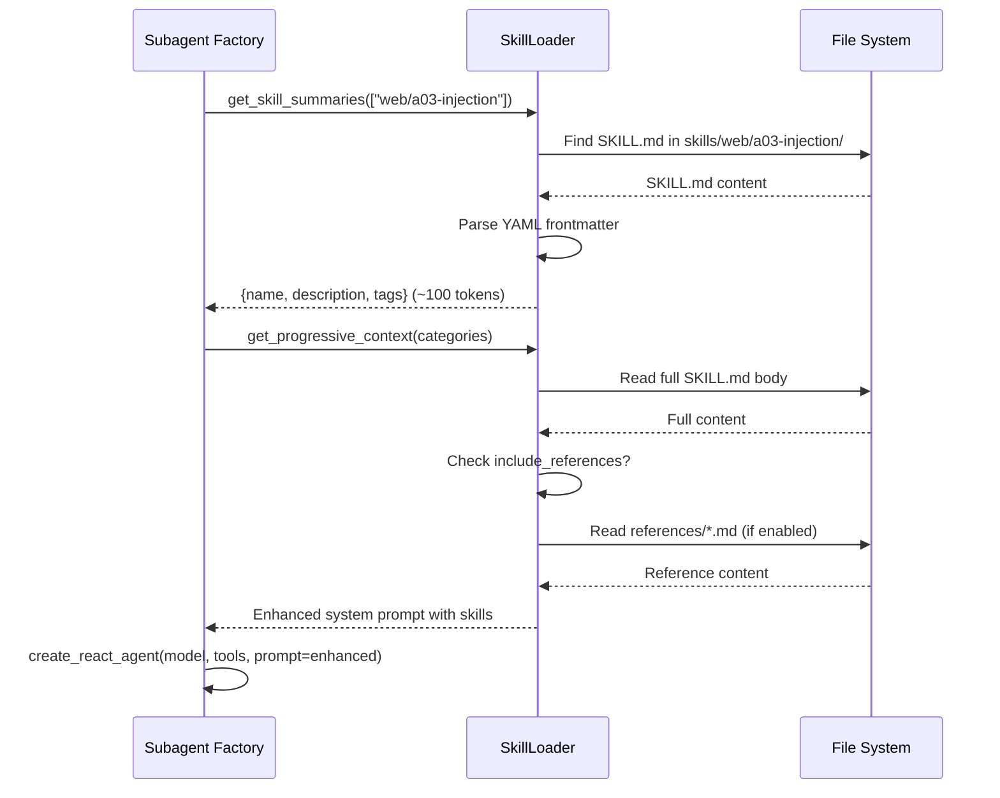

### Skill Inventory

| Category | Skills | References | Coverage |
|----------|--------|------------|----------|
| `web/` | 11 SKILL.md | 25+ refs | OWASP A01–A10, XSS, API, File Attacks |
| `network/` | 8 SKILL.md | 30+ refs | Databases, containers, email, wireless, ICS/IoT |
| `injection/` | 7 SKILL.md | — | XSS, SQLi, SSRF, SSTI, XXE, RCE, LFI |
| `authentication/` | 2 SKILL.md | — | IDOR, JWT attacks |
| `configuration/` | 2 SKILL.md | — | CORS, security headers |
| `mobile/` | 3 SKILL.md | 3 refs | Android, iOS pentesting |
| `active-directory/` | varies | varies | AD attack techniques |
| `exploitation/` | 1 file | — | PoC templates |
| `logic/` | 1 SKILL.md | — | Race conditions |
| `reconnaissance/` | 1 file | — | Subdomain enumeration |
| `vulnerabilities/` | 4 files | — | XSS, SQLi, SSRF, IDOR testing guides |
| **Total** | **46 SKILL.md** | **113 references** | — |

---

## 8. LLM Router (Multi-Provider)

The `LLMRouter` class provides **per-agent model routing** — each of the 12 subagents can use a different LLM provider and model.

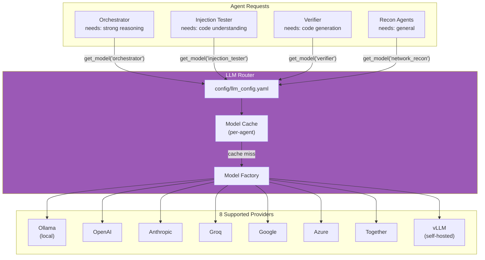

### Configuration Resolution

```
1. Check agents.{agent_type} in llm_config.yaml
2. If not found, use default config
3. Merge agent config with defaults (agent overrides default)
4. Resolve ${ENV_VAR} references in api_key fields
5. Create provider-specific ChatModel (ChatOllama, ChatOpenAI, etc.)
6. Cache model instance for reuse
```

### Recommended Model Selection

| Task Type | Recommended Models | Why |
|-----------|-------------------|-----|
| **Orchestrator** | qwen2.5:14b, gpt-4o, claude-3-sonnet | Needs strong reasoning for planning |
| **Injection/Verifier** | qwen2.5-coder:14b, gpt-4o | Needs code understanding for payload crafting |
| **Recon/Discovery** | mistral:7b, qwen2.5:7b | Simpler tasks, faster models sufficient |
| **Reporter** | qwen2.5:7b | Text generation, any capable model works |

---

## 9. Tool Execution Pipeline

All security tools execute inside the Kali Linux Docker container. The pipeline:

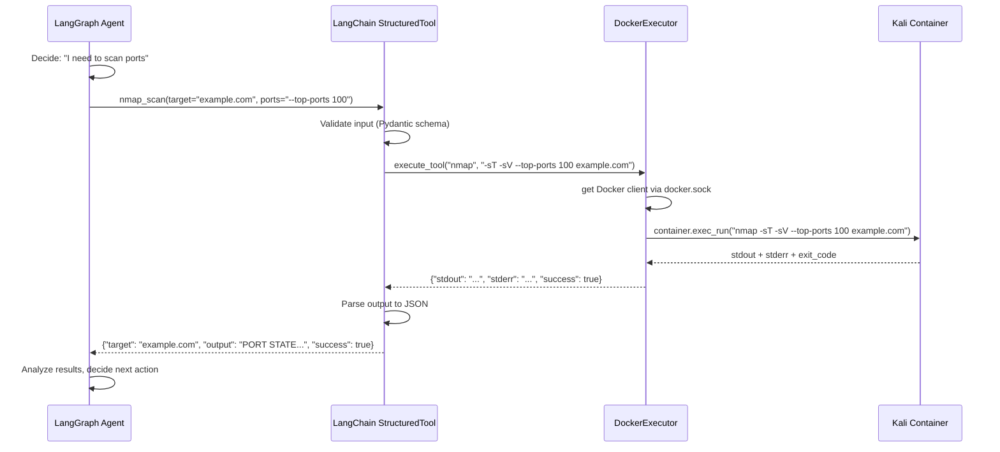

### DockerExecutor Details

- **Connection**: Unix socket `/var/run/docker.sock` mounted into the app container
- **Container lookup**: By name (`KALI_CONTAINER_NAME` env var, default: `redstrike-kali`)
- **Execution**: `container.exec_run(cmd)` — synchronous execution, captures stdout/stderr
- **Timeout**: Configurable per-tool (long-running tools like sqlmap need higher limits)
- **Wordlists**: Mapped to `/wordlists/SecLists/...` paths inside the Kali container

### Tool Categories

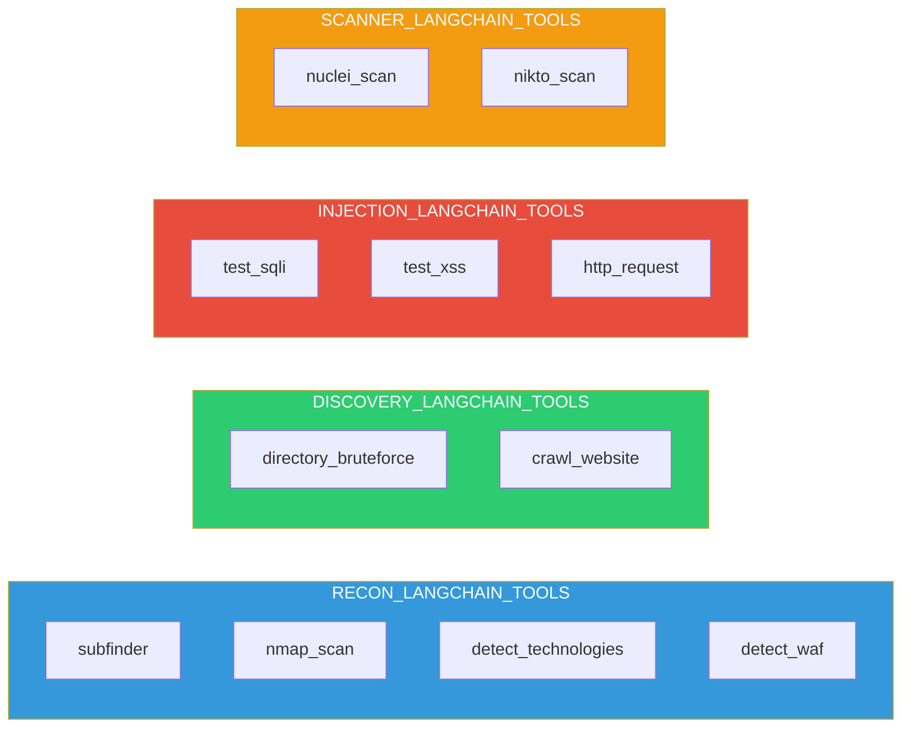

---

## 10. Database Schema

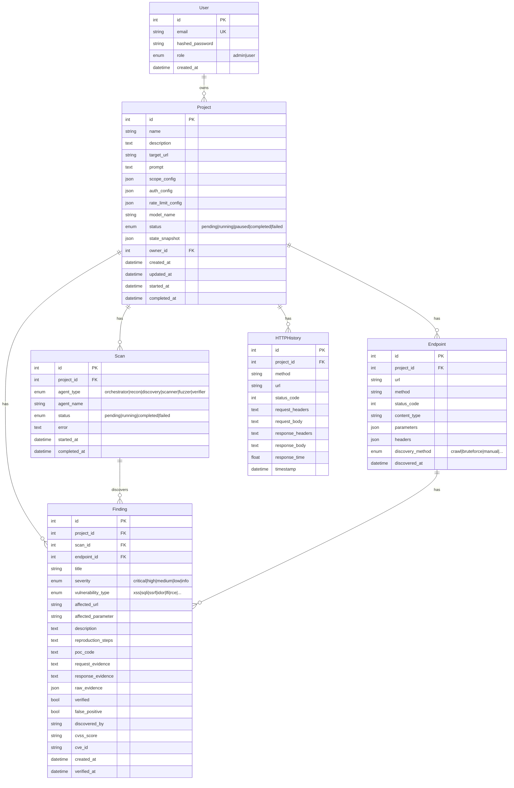

### Key Design Notes

- **`state_snapshot`** (JSON): Stores the LangGraph `ScanState` for pause/resume. When a scan is paused, the current phase index and plan are serialized here.
- **`scope_config`** (JSON): Stores allowed domains, excluded paths, extracted from the user's natural language prompt by the orchestrator.
- **Cascade deletes**: Deleting a project cascades to scans, findings, endpoints, and HTTP history.
- **Finding verification**: Two booleans — `verified` (confirmed by verifier agent) and `false_positive` (manually marked by user).

---

## 11. API Layer

### Architecture

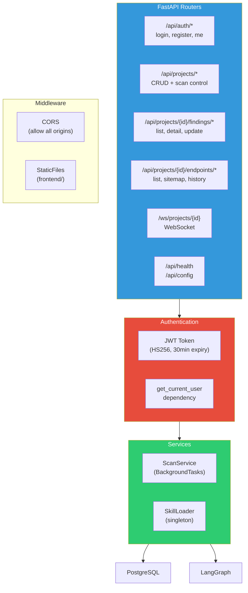

### Authentication Flow

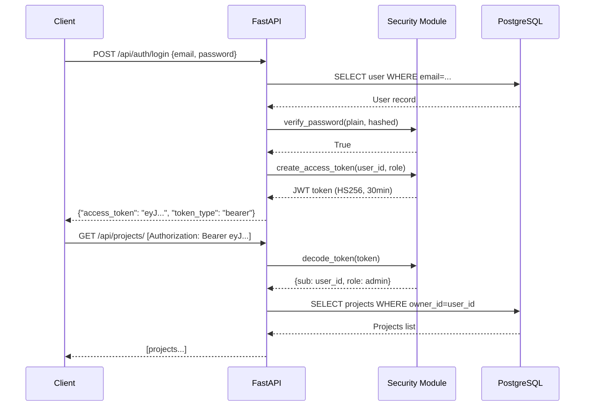

---

## 12. Real-time Communication

### WebSocket Architecture

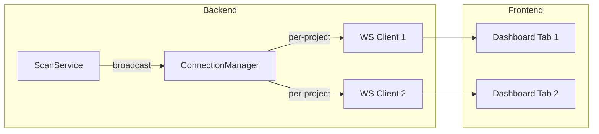

The `ConnectionManager` maintains a `Dict[int, Set[WebSocket]]` — mapping project IDs to connected WebSocket clients. Events are broadcast to all clients watching a specific project.

### Event Types

| Event | Payload | Trigger |
|-------|---------|---------|
| `scan_update` | `{phase, status, message, data}` | Phase start/complete/error |
| `new_finding` | `{id, title, severity}` | Finding saved to database |
| `new_endpoint` | `{url, method, status_code}` | Endpoint discovered |
| `scan_complete` | `{findings, endpoints, duration}` | All phases complete |
| `ping`/`pong` | — | Keep-alive |

### Fallback: Async Polling

If WebSocket disconnects, the frontend can poll `GET /api/projects/{id}/status`:

```json
{
  "project_id": 1,
  "project_status": "running",
  "scan_progress": {
    "phase": "injection_testing",
    "phase_index": 3,
    "total_phases": 5,
    "status": "running",
    "message": "Running injection_testing...",
    "progress_percent": 60,
    "started_at": "2026-04-01T10:00:00",
    "updated_at": "2026-04-01T10:05:30"
  }
}
```

---

## 13. Scan Lifecycle & Data Flow

### End-to-End Data Flow

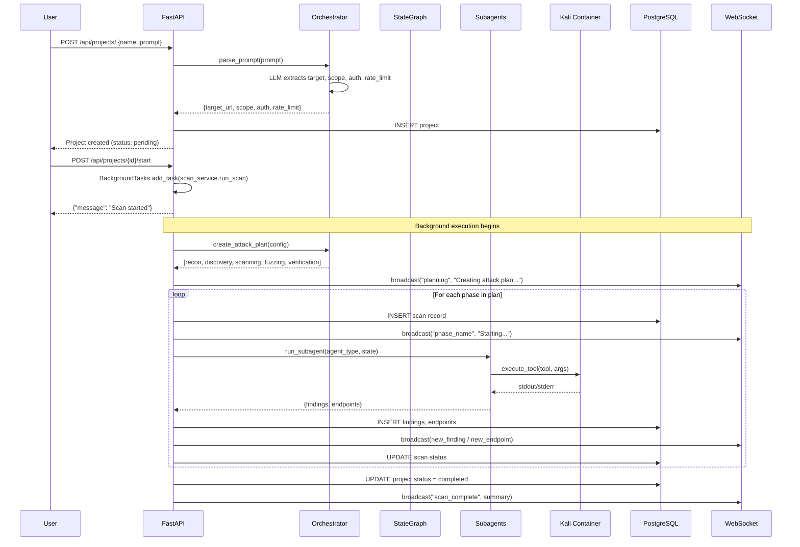

### Pause/Resume Flow

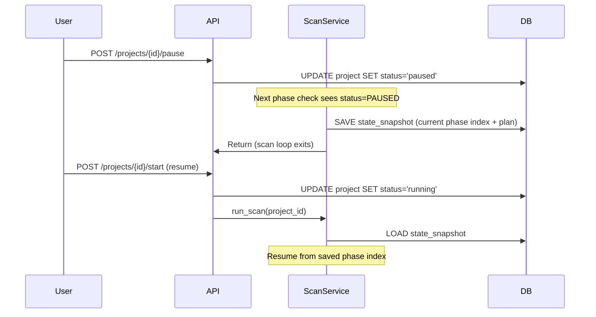

---

## 14. Security Design

### Threat Model

| Threat | Mitigation |
|--------|-----------|
| **Unauthorized access** | JWT authentication on all API endpoints, WebSocket auth via token query param |
| **Tool escape** | All tools execute in isolated Kali Docker container, not on host |
| **Scope violation** | Orchestrator extracts scope from prompt, agents check scope before tool execution |
| **Credential exposure** | Admin password auto-generated on first run, JWT secret configurable |
| **Data leakage** | Projects owned per-user, all queries filter by `owner_id` |
| **Docker socket access** | Only the app container has docker.sock access (required for tool execution) |

### Authentication & Authorization

- **JWT tokens**: HS256 algorithm, 30-minute access token, 7-day refresh token
- **User roles**: `admin` and `user` (admin can register new users)
- **Per-user isolation**: All project/finding queries filtered by `owner_id`
- **Password hashing**: bcrypt via passlib

### Container Isolation

```
Host OS
└── Docker Network (redstrike-network, bridge mode)
    ├── redstrike-app    — Only has docker.sock + DB access
    ├── redstrike-db     — Only accessible within Docker network
    └── redstrike-kali   — Privileged (needed for nmap), but:
                           • No port mapping to host
                           • No docker.sock access
                           • Read-only skills mount
                           • Only accessed via exec_run()
```

---

## 15. Frontend Architecture

The current frontend is a **vanilla HTML/CSS/JS single-page application** served as static files by FastAPI.

```
frontend/
├── index.html        # Single HTML file with all views
├── css/
│   └── styles.css    # Dark theme styles
└── js/
    ├── api.js        # REST API client (fetch wrapper + JWT)
    ├── websocket.js  # WebSocket client (auto-reconnect)
    └── app.js        # View routing, event handlers, DOM manipulation
```

### View Architecture

| View | Route | Data Source |
|------|-------|-------------|
| Login | `#login` | `POST /api/auth/login` |
| Projects | `#projects` | `GET /api/projects/` |
| Project Detail | `#project/{id}` | `GET /api/projects/{id}` + WebSocket |
| Site View | `#site-view` | `GET /api/projects/{id}/sitemap` |
| Findings | `#findings` | `GET /api/projects/{id}/findings` |
| Settings | `#settings` | `GET /api/config` |

> **Note**: The frontend is planned for a major overhaul to better surface backend capabilities (scan control, charts, HTTP history, per-agent config).

---

## 16. Key Design Decisions

| Decision | Rationale |
|----------|-----------|
| **LangGraph over smolagents** | Deep Agents pattern provides better separation of concerns, per-agent context management, and conditional routing |
| **Per-agent LLM routing** | Different tasks need different model strengths — use a strong coder for injection testing, a fast model for recon |
| **Skills as SKILL.md files** | Follows the agentskills.io standard, easy for non-developers to contribute knowledge |
| **Progressive disclosure** | Prevents context window overflow — only load detailed knowledge when the agent needs it |
| **Docker-based tool execution** | Isolates all security tools from the host, reproducible environment, no host dependencies |
| **PostgreSQL over SQLite** | Multi-user support, concurrent access, production-ready |
| **Vanilla frontend** | Simple to serve (FastAPI StaticFiles), no build step, easy to iterate — migration to React/Vite planned |
| **WebSocket + polling** | WebSocket for real-time experience, polling as fallback for reliability |
| **Two-step verification** | Reduces false positives — all findings go through a dedicated verifier agent before being reported as confirmed |
| **State persistence in DB** | Enables pause/resume — the scan state snapshot is saved as JSON in the project record |

---

<p align="center">
  <strong>RedStrike.AI</strong> — Built with LangGraph Deep Agents 🧠
</p>
